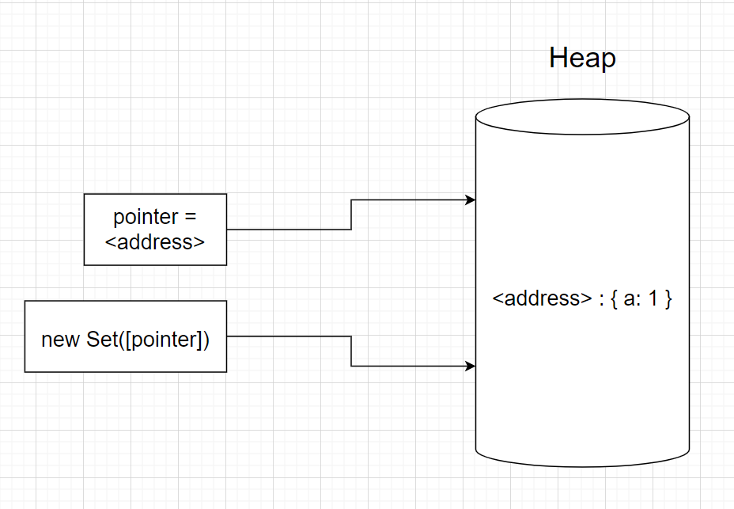
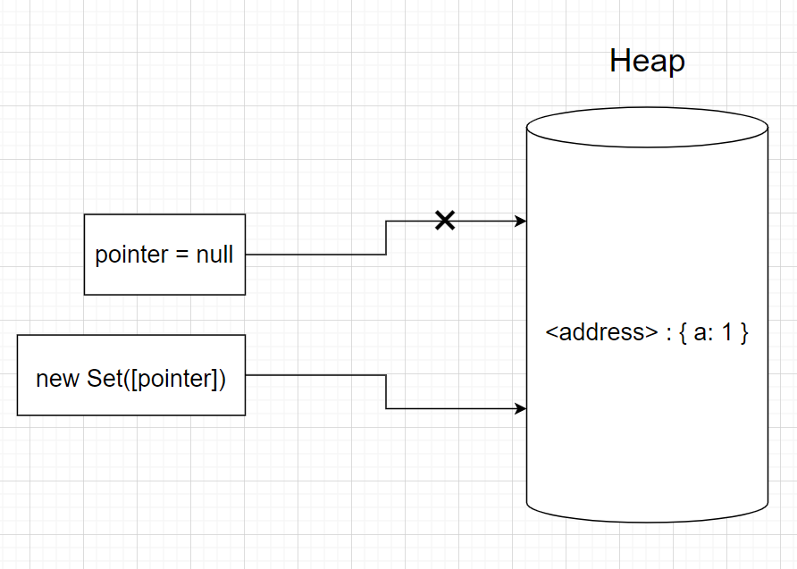
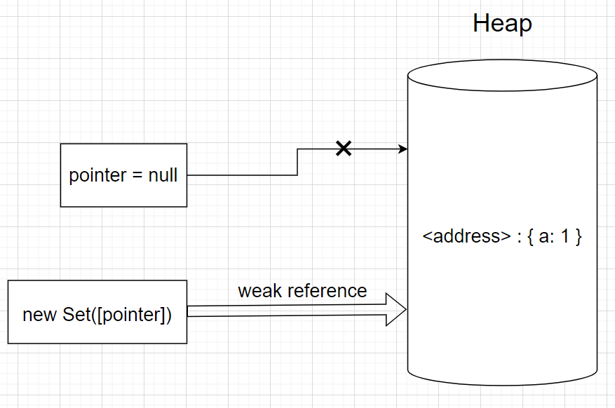

# Set and WeakSet

## 解决的问题

### Set

- 保存唯一的值

### WeakSet

- 解决 Set 可能会导致内存泄露的问题

## 原理

### Set

- Set 中的引用属于强引用

- 强引用 (strong reference) : 会影响到对象的可达性 (reachability)，即会阻止对象被垃圾回收器回收

_Example_

- 此时有两个强引用指向同一个对象

```js
let pointer = { a: 1 }
new Set([pointer])
```



- 将 `pointer` 设置为 `null`，此时还有 `Set` 中的一个强引用，因此堆中的对象不会被垃圾回收器回收

```js {3}
let pointer = { a: 1 }
new Set([pointer])
pointer = null
```



### WeakSet

- WeakSet 中的引用属于弱引用

- 弱引用 (weak reference) : 不会影响对象的可达性，即不会阻止对象被垃圾回收器回收

```js
let pointer = { a: 1 }
new WeakSet([pointer])
pointer = null
```

- `pointer` 设置为 `null` 后，由于 WeakSet 中的引用是弱引用，所以堆中的对象此时是不可达的，因此会被垃圾回收器回收



## Refs

- [Garbage Collection](https://javascript.info/garbage-collection)
- [Strong and Weak Reference](https://elliotchance.medium.com/strong-vs-weak-references-70356d37dfd2)
