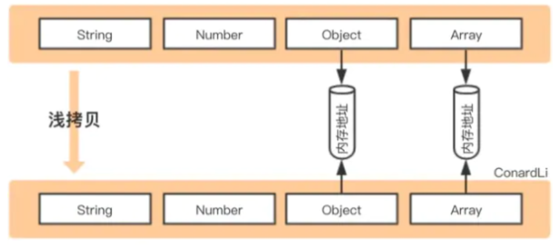
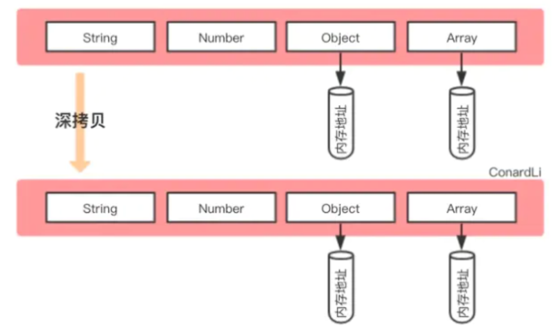

# Shallow and Deep Copy

## Shallow Copy

### Definition

- 如果属性值是原始值类型，则复制原始值；如果属性值是对象类型，则复制堆内存地址



### Spread Syntax (object / array)

_object_

```js
const obj1 = {
  a: { b: 1 }
}
const obj2 = { ...obj1 }
console.log(obj1.a === obj2.a) // true
```

_array_

```js
const arr1 = [
  { a: 1 },
]
const arr2 = [...arr1]
console.log(arr1[0] === arr2[0]) // true
```

### Rest Parameter (object / array)

_object_

```js
const obj1 = {
  a: { b: 1 }
}
const { ...obj2 } = obj1
console.log(obj1.a === obj2.a) // true
```

_array_

```js
const arr1 = [
  { a: 1 },
]
const [...arr2] = arr1
console.log(arr1[0] === arr2[0]) // true
```

### Object.assign() (object / array)

_object_

```js
const obj1 = {
  a: { b: 1 }
}
const obj2 = Object.assign({}, obj1)
console.log(obj1.a === obj2.a) // true
```

_array_

```js
const arr1 = [
  { a: 1 },
]
const arr2 = Object.assign([], arr1)
console.log(arr1[0] === arr2[0]) // true
```

## Deep Copy

### Definition

- 如果属性值是原始值类型，则复制原始值；如果属性值是对象类型，则在堆中创建新对象，保存新的堆内存地址



### StructuredClone() [object / array]

_object_

```js
import structuredClone from '@ungap/structured-clone' // polyfill

const obj1 = {
  a: { b: 1 }
}
const obj2 = structuredClone(obj1)
console.log(obj1.a === obj2.a) // false
```

_array_

```js
import structuredClone from '@ungap/structured-clone' // polyfill

const arr1 = [
  { a: 1 },
]
const arr2 = structuredClone(arr1)
console.log(arr1[0] === arr2[0]) // false
```

### Lodash

_object_

```js
const obj1 = {
  a: { b: 1 }
}
const obj2 = _.cloneDeep(obj1)
console.log(obj1.a === obj2.a) // false
```

_array_

```js
const arr1 = [
  { a: 1 },
]
const arr2 = _.cloneDeep(arr1)
console.log(arr1[0] === arr2[0]) // false
```

### Implement Deep Copy

```js
function deepCopy(original) {
  if (Array.isArray(original)) {
    const copy = []
    for (const [index, val] of original.entries()) {
      copy[index] = deepCopy(val)
    }
    return copy
  }
  if (typeof original === 'object' && original !== null) {
    const copy = {}
    for (const [key, val] of Object.entries(original)) {
      copy[key] = deepCopy(val)
    }
    return copy
  }
  // primitives
  return original
}
```

## Refs

- [definitions of shallow and deep clone](https://dmitripavlutin.com/javascript-shallow-clone-objects/)
- [shallow clone methods](https://dmitripavlutin.com/javascript-shallow-clone-objects/)
- [deep clone methods](https://stackoverflow.com/questions/122102/what-is-the-most-efficient-way-to-deep-clone-an-object-in-javascript/122704#122704)
- [implement generic deep copy](https://exploringjs.com/deep-js/ch_copying-objects-and-arrays.html#implementing-generic-deep-copying)
