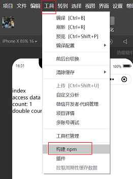

# 组件通信方式

## 父组件 -> 子组件

### properties

- 父组件为子组件设置属性
- 子组件通过 `properties` 接收

:::: code-group

::: code-group-item tabOne.wxml
```html
<custom-comp num="{{ 1 }}" />
```
:::

::: code-group-item custom-comp.wxml
```html
<view>number form parent: {{ num }}</view>
```
:::

::: code-group-item custom-comp.js
```js
Component({
  properties: {
    num: {
      type: Number,
      value: 0,
    },
  },
})
```
:::

::::

### selectComponent

- 父组件通过 `selectComponent` 获取子组件实例

:::: code-group

::: code-group-item tabOne.wxml
```html
<custom-comp class="child" />
<button bind:tap="getChildInstance">get child instance</button>
```
:::

::: code-group-item tabOne.js
```js
Page({
  getChildInstance() {
    const child = this.selectComponent('.child')
  },
})
```
:::

::::

## 子组件 -> 父组件

### triggerEvent

- 子组件通过 `triggerEvent` 向父组件发送事件和数据
- 父组件监听事件，从 `event.detail` 中获取数据

:::: code-group

::: code-group-item custom-comp.wxml
```html
<button bind:tap="handleTap">send data to parent</button>
```
:::

::: code-group-item custom-comp.js
```js
Component({
  methods: {
    handleTap() {
      this.triggerEvent('send', { name: 'eathyn' })
    },
  },
})
```
:::

::::

:::: code-group

::: code-group-item tabOne.wxml
```html
<custom-comp bind:send="handleSend" />
```
:::

::: code-group-item tabOne.js
```js
Page({
  handleSend(evt) {
    const { name } = evt.detail
    console.log('data from child: ', name)
  },
})
```
:::

::::

## 兄弟组件 -> 兄弟组件

- 子组件将数据传递给父组件，父组件再将数据传递给改子组件的兄弟组件
- eg: `ChildOne` 将数据传递给 `Parent`，`Parent` 将数据传递给 `ChildTwo`

_Parent_

:::: code-group

::: code-group-item parent.wxml
```html
<ChildOne bind:send="passDataToChildTwo" />
<ChildTwo a="{{ a }}" />
```
:::

::: code-group-item parent.js
```js
Component({
  data: {
    a: 0,
  },
  
  methods: {
    passDataToChildTwo(evt) {
      const { a } = evt.detail
      this.setData({
        a,
      })
    },
  },
})
```
:::

::::

_Child One_

:::: code-group

::: code-group-item child-one.wxml
```html
<button bind:tap="passData">pass data to child two</button>
```
:::

::: code-group-item child-one.js
```js
Component({
  methods: {
    passData() {
      this.triggerEvent('send', { a: 1 })
    }
  },
})
```
:::

::::

_Child Two_

:::: code-group

::: code-group-item child-two.wxml
```html
<view>a: {{ a }}</view>
```
:::

::: code-group-item child-two.js
```js
Component({
  properties: {
    a: {
      type: Number,
      value: 0,
    },
  }
})
```
:::

::::

## 全局

1. install packages: `npm install --save mobx-miniprogram mobx-miniprogram-bindings`
2. configure in components or pages

_Store_

```js
import { observable, action } from 'mobx-miniprogram'

export const store = observable({
  // data
  count: 1,
  
  // computed
  get doubleCount() {
    return this.count * 2
  },
  
  // action
  increment: action(function() {
    this.count++
  })
})
```

_Component_

:::: code-group

::: code-group-item access-data.wxml
```html
<view>access data component</view>
<view>count: {{ count }}</view>
<view>double count: {{ doubleCount }}</view>
<button bind:tap="increment">increment</button>
```
:::

::: code-group-item access-data.js
```js
import { storeBindingsBehavior } from 'mobx-miniprogram-bindings'
import { store } from '../../store/index.js'

Component({
  behaviors: [storeBindingsBehavior],
  
  storeBindings: {
    store,
    fields: {
      count: () => store.count,
      doubleCount: () => store.doubleCount,
    },
    actions: {
      increment: 'increment'
    },
  },
  
  methods: {
    increment() {
      console.log('count before increment: ', this.data.count)
      this.data.increment()
      console.log('count after increment: ', this.data.count)
    },
  },
})
```
:::

::::

### Attentions

- 微信小程序安装完包之后需要微信开发者环境构建



## Refs

- [组件通信](https://developers.weixin.qq.com/miniprogram/dev/framework/custom-component/events.html)
- [MobX](https://github.com/wechat-miniprogram/mobx-miniprogram-bindings)
