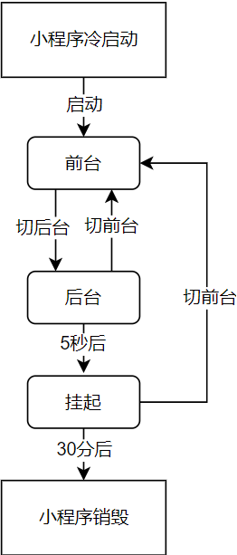

# 生命周期钩子

## 小程序运行机制

### 前台切后台的方式

- 点击右上角胶囊按钮离开小程序
- iOS 从屏幕左侧右滑离开小程序
- 安卓点击返回键离开小程序
- 小程序前台运行时直接把微信切后台（手势或 Home 键）
- 小程序前台运行时直接锁屏

## App

### 生命周期函数

- onLaunch: 小程序启动
- onShow: 小程序启动或切前台
- onHide: 前台切后台
- onError: 错误监听函数
- onPageNotFound: 页面不存在监听函数
- onUnhandledRejection: 未处理的 Promise 拒绝事件监听函数
- onThemeChange: 监听系统主题变化

## Page

### 页面生命周期执行流程图

### 生命周期函数

- onLoad: 页面加载
- onShow: 页面显示或从后台切换到前台
- onReady: 页面初次渲染完成时触发，一个页面只会调用一次
- onHide: 页面隐藏或从前台切换到后台
- onUnload: 页面卸载

## Component

### 组件生命周期函数 (lifetimes)

- created: 组件实例已创建，无法调用 `setData`
- attached: 组件已初始化，已进入页面节点树，`data` 已初始化
- ready: 视图层布局已完成
- detached: 组件实例已从页面中移除
- moved: 在组件实例被移动到节点树另一个位置
- error: 组件方法抛出错误

### 组件所在页面的生命周期 (pageLifetimes)

- show: 组件所在页面显示或从后台切换到前台
- hide: 组件所在页面隐藏或从前台切换到后台
- resize: 组件所在的页面尺寸变化

## Refs

- [小程序运行机制](https://developers.weixin.qq.com/miniprogram/dev/framework/runtime/operating-mechanism.html)
- [App 生命周期](https://developers.weixin.qq.com/miniprogram/dev/reference/api/App.html)
- [Page 生命周期](https://developers.weixin.qq.com/miniprogram/dev/reference/api/Page.html#%E7%94%9F%E5%91%BD%E5%91%A8%E6%9C%9F%E5%9B%9E%E8%B0%83%E5%87%BD%E6%95%B0)
- [Component 生命周期](https://developers.weixin.qq.com/miniprogram/dev/framework/custom-component/lifetimes.html)
