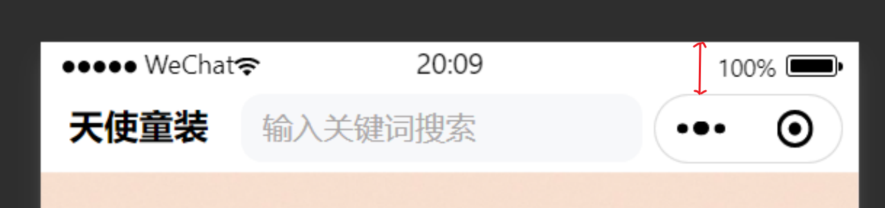

# Skills

## Non-promise to Promise

### Background

- `success` and `fail` in API like `wx.request` or `wx.uploadFile` are callbacks so the readability and maintainability is poor.

```js
wx.request({
  url: 'test-url',
  method: 'GET',
  success: () => {},
  fail: () => {},
})
```

- It's better to return a promise so that we can use `await` keyword to deal with callback hell.

### Solution-1

- Encapsulating a function that returns a `promise`. In that `promise`, we can assign `resolve` and `reject` to `success` and `fail` respectively.

```js
function wxToPromise(method, options = {}) {
  return new Promsise ((resolve, reject) => {
    options.success = resolve
    options.reject = (error) => {
      reject(error)
    }
    wx[method](options)
  })
}
```

### Solution-2

- Using [miniprogram-api-promise](https://github.com/wechat-miniprogram/miniprogram-api-promise) package.

## 禁止滚动穿透

### Background

- 滑动弹窗的内容时，弹窗下层的内容也会跟着滑动。看起来好像是上面的滚动事件穿透到下面的 DOM 元素上一样，所以称之为滚动穿透

### Solution

- 使用微信小程序的 `page-meta` 组件配置样式。当出现弹窗时，`page-meta` 的 `overflow` 属性设置为 `hidden`。

```html
<page-meta page-style="{{ showPopup ? 'overflow: hidden' : '' }}" />
```

## 获取胶囊到可视区顶边的距离

- 红色箭头标出的部分为胶囊到可视区顶边的距离。



- 通过 `wx.getMenuButtonBoundingClientRect` 对象的 `top` 属性获取该数据。

```js
const menuButton = wx.getMenuButtonBoundingClientRect()
menuButton.top
```
