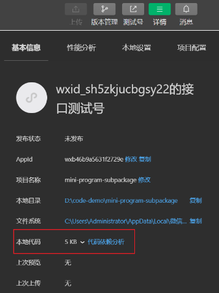

# 分包

## 原因

> Reference: [使用分包的原因](https://developers.weixin.qq.com/miniprogram/dev/framework/performance/tips/start_optimizeA.html)

- 主包的体积上限为 2M，如果超过 2M 需要进行分包。
- 可以显著减少启动时需要下载的代码包大小。

## 使用分包

> Reference: [使用分包](https://developers.weixin.qq.com/miniprogram/dev/framework/subpackages/basic.html)

### 配置

- 在 `app.json` 中定义 `subpackages` 字段，在该字段中定义分包。

```json
{
  "subpackages": [
    {
      "root": "packageA",
      "pages": [
        "pages/cat/cat",
        "pages/dog/dog"
      ]
    }
  ]
}
```

- 在 `微信开发者工具->详情->基本信息->代码依赖分析` 中可以查看主包和分包的信息。



### 打包原则

- `subpackages` 配置路径外的目录将被打包到主包中。
- `subpackage` 的根目录不能是另外一个 `subpackage` 内的子目录。
- `tabBar` 页面必须在主包内。

### 引用原则

- packageA 无法 require packageB JS 文件，但可以 require 主包、packageA 内的 JS 文件；使用分包异步化时不受此条限制。
- packageA 无法 import packageB 的 template，但可以 require 主包、packageA 内的 template。
- packageA 无法使用 packageB 的资源，但可以使用主包、packageA 内的资源。

## 独立分包

- 独立分包是小程序中一种特殊的分包，可以独立与于主包和其他分包运行。从独立分包中页面进入小程序时，不需要下载主包。当用户进入普通分包或主包内页面时，主包才会被下载。
