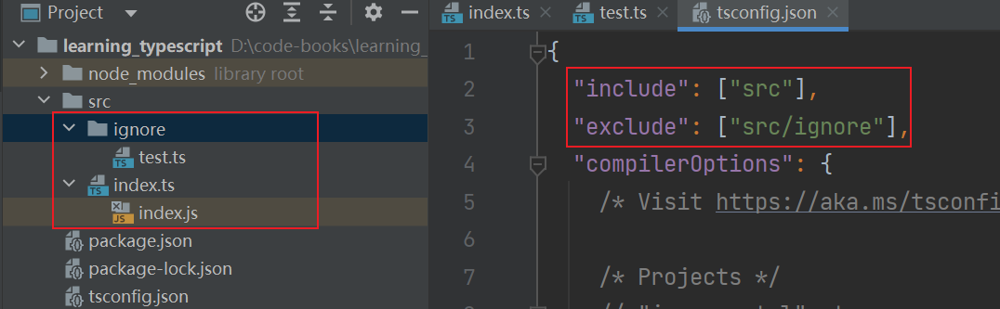

# Configuration Options

- Configuring TypeScript options via either command-line flags passed to `tsc` or seperated `tsconfig.json` file.

## tsc Options

- The `tsc` command can take in most of TypeScript's configuration options as `--` flags.

```bash
# skip emitting an js file
tsc <ts file> --noEmit
```

### Pretty Mode

- pretty mode: stylized with colors and spacing to make them easier to read
- pretty mode flag: `--pretty`

### Watch Mode

- watch mode: recompile TypeScript after changing the code
- watch mode flag: `--watch` / `-w`

## TSConfig Files

- `--project` / `-p` flag: specify the path of `tsconfig.json` file

```bash
tsc --project path/to/tsconfig.json
```

### tsc --init

- `--init` flag: creating a new `tsconfig.json`:

```bash
tsc --init
```

- It's recommended using `tsc --init` to create the configuration file for new TypeScript project.

### CLI Versus Configuration

- Most options available in both the CLI and in TSConfig files fall into one of two categories:
  - compiler: how each included file is compiled and/or type checked by TypeScript
  - file: which files will or will not have TypeScript run on them

## File Inclusions

- hidden `.ts` files: ts files whose names start with a `.`
- By default, `tsc` will run on all non-hidden `.ts` files, ignoring hidden directories and directories named `node_modules`.

### include

- The `include` option is an array of strings that describes what directories and/or files to include in TypeScript compilation.

_TypeScript compiler will include and compile **src** directory_

```json
{
  "include": ["src"]
}
```

- Glob wildcards are allowed in `include`.

### exclude

- TSConfig file can omit paths from `include` by specifying them in a top-level `exclude`.

_example: TS compiler won't compile `.ts` files in `src/ignore` folder_



- By default, `exclude` contains `["node_modules", "bower_components", "jspm_packages"]` to avoid running the TypeScript compiler on compiled third-party library files.

- Q : `exclude` only acts to remove files from the starting list in `include`. TypeScript will run on any file imported by any included file, even if the imported file is explicitly listed in `exclude`.

## Alternative Extensions

### JSX Syntax

TODO: read after learning React JSX

### resolveJsonModule

- If `resolveJsonModule` is `true`, JSON files can be imported from as if they were `.ts` files exporting `const` objects.

_tsconfig.json_

```json
{
  "compilerOptions": {
    "resolveJsonModule": true
  }
}
```

_data.json_

```json
{
  "name": "eathyn",
  "age": 25
}
```

_index.ts_

```ts
import { name, age } from './data.json'

console.log(name)
console.log(age)
```

- Default imports may be used if `resolveJsonModule` and `esModuleInterop` both are `true`

_tsconfig.json_

```json
{
  "resolveJsonModule": true,
  "esModuleInterop": true
}
```

_data.json_

```json
{
  "name": "eathyn",
  "age": 25
}
```

_index.ts_

```ts
import data from './data.json'
console.log(data)
```

- If the JSON file contains literal types except `Object`, we will have to use the `* as import` syntax.

_data.json_

```json
[1, 2, 3]
```

_index.ts_

```ts
import * as numbers from './data.json'

// { '0': [Getter], '1': [Getter], '2': [Getter], default: [ 1, 2, 3 ] }
console.log(numbers)
```

## Emit

### outDir

- By default, TypeScript places output files alongside their corresponding source files.

```markdown
Before Compilation:
- src
  - test
    - index.ts

After Compilation:
- src
  - test
    - index.ts
    - index.js
```

- Outputting to other directory by setting `outDir`.

_tsconfig.json_

```json
{
  "compilerOptions": {
    "outDir": "dist"
  }
}
```

```markdown
Before Compilation:
- src
  - test-1
    - index.ts
  - test-2
    - index.ts

After Compilation:
- dist
  - test-1
    - index.ts
  - test-2
    - index.ts
- src
  - test-1
    - index.ts
  - test-2
    - index.ts
```
