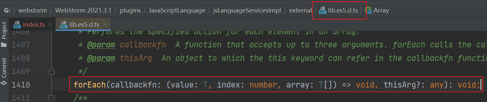

# 71 TS 内置类型声明文件

- TS 为所有的 JS API 提供了类型声明文件

```ts
const arr = [1, 2, 3]
arr.forEach((item) => {
  console.log(item)
})
```



- TS 为所有的 Web API 提供了类型声明文件

```ts
setTimeout(() => {
  console.log('hello')
}, 1000)
```


## Refs

[TS 内置类型声明文件](https://www.bilibili.com/video/BV14Z4y1u7pi?p=71&vd_source=9b4e3dff7609ad29f13d886e715862ba)
