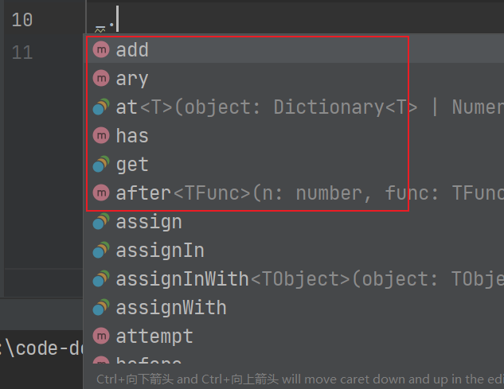

# 72 第三方库的类型声明文件

- 第三方库的类型声明文件有两种存在方式 :
  - 库自带的类型声明文件
  - 由 DefinitelyTyped 提供的类型声明文件

## 库自带的类型声明文件

- 有些库会自己携带类型声明文件，例如 `axios`

_axios' package.json_

```json
{
  "name": "axios",
  "main": "index.js",
  "types": "index.d.ts"
}
```

_index.d.ts_


## DefinitelyTyped

- [DefinitelyTyped](https://github.com/DefinitelyTyped/DefinitelyTyped) 是一个提供常见包的类型声明文件的仓库，当一些包自身没有提供 TS 类型声明文件时，就可以从这个仓库中下载该包的 TS 类型声明文件
- [Type Search](https://www.typescriptlang.org/dt/search) 可以快速查找 `DefinitelyTyped` 中是否有某个包的 TS 类型声明文件

### 例子

- `lodash` 自身没有 TS 类型声明文件，编写代码时没有提供代码提示和类型校验。首先通过 Type Search 查询是否有 `lodash` 的 TS 类型声明文件，如果有则下载，安装之后 TS 会自动加载该类型声明文件
- 使用 `import xxx from xxx` 会报错，[参考](https://github.com/microsoft/TypeScript/issues/27293#issuecomment-549047461)

```ts
// ok
import * as _ from 'lodash'

// ok
// import _ = require('lodash')

// error
// import _ from 'lodash'

console.log(_.add(1, 2))
```



## Refs

- [第三方库的类型声明文件](https://www.bilibili.com/video/BV14Z4y1u7pi?p=72&vd_source=9b4e3dff7609ad29f13d886e715862ba)
