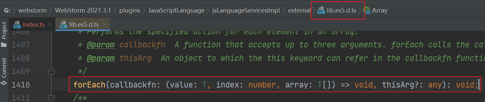
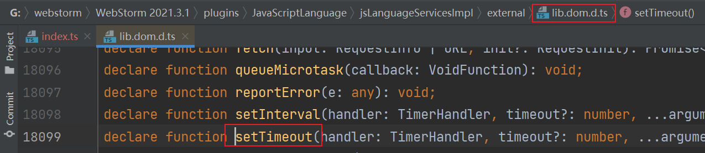
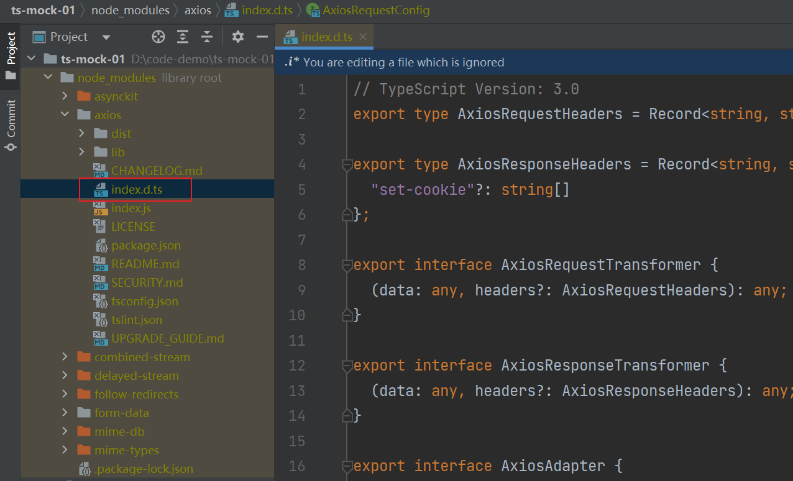

# Declaration File

## Definition

> Reference: [Course-69](https://www.bilibili.com/video/BV14Z4y1u7pi/?p=69&vd_source=9b4e3dff7609ad29f13d886e715862ba)

- 类型声明文件 (declaration files) 的作用是为 JavaScript 提供类型信息，这样在 TS 项目中使用这些库时，就可以获得代码提示和类型保护等机制。


- `Axios` 的类型声明文件定义在 `node_modules\axios\index.d.ts` 文件中。


## .ts vs .d.ts

> Reference: [Course-70](https://www.bilibili.com/video/BV14Z4y1u7pi/?p=69&vd_source=9b4e3dff7609ad29f13d886e715862ba)

### .ts

- 可以包含类型信息和可执行代码
- 可以被 ts 编译器编译为 js 文件

```ts
interface Person {
  name: string
  age: number
}

function fn() {}
```

### .d.ts

- 只能包含类型信息，不能包含可执行代码
- 不可以被 ts 编译器编译为 js 文件

```ts
interface Person {
  name: string
  age: number
}

// TS1046: Top-level declarations in .d.ts files must start with either a 'declare' or 'export' modifier.
function fn() {}
```

## TS 内置类型声明文件

> Reference: [Course-71](https://www.bilibili.com/video/BV14Z4y1u7pi/?p=69&vd_source=9b4e3dff7609ad29f13d886e715862ba)

- TS 为所有的 JS API 提供了类型声明文件

```ts
const arr = [1, 2, 3]
arr.forEach((item) => {
  console.log(item)
})
```



- TS 为所有的 Web API 提供了类型声明文件

```ts
setTimeout(() => {
  console.log('hello')
}, 1000)
```



## 第三方库的类型声明文件

> Reference: [Course-72](https://www.bilibili.com/video/BV14Z4y1u7pi/?p=69&vd_source=9b4e3dff7609ad29f13d886e715862ba)

第三方库的类型声明文件有两种存在方式 :
  - 库自带的类型声明文件
  - 由 DefinitelyTyped 提供的类型声明文件

### 库自带的类型声明文件

- 有些库会自己携带类型声明文件，例如 `axios`

_axios package.json_

```json
{
  "name": "axios",
  "main": "index.js",
  "types": "index.d.ts"
}
```

_index.d.ts_



### DefinitelyTyped

- [DefinitelyTyped](https://github.com/DefinitelyTyped/DefinitelyTyped) 是一个提供常见包的类型声明文件的仓库，当一些包自身没有提供 TS 类型声明文件时，就可以从这个仓库中下载该包的 TS 类型声明文件
- [Type Search](https://www.typescriptlang.org/dt/search) 可以快速查找 `DefinitelyTyped` 中是否有某个包的 TS 类型声明文件

_例子：_

- `lodash` 自身没有 TS 类型声明文件，编写代码时没有提供代码提示和类型校验。首先通过 Type Search 查询是否有 `lodash` 的 TS 类型声明文件，如果有则下载，安装之后 TS 会自动加载该类型声明文件
- 使用 `import xxx from xxx` 会报错，[参考](https://github.com/microsoft/TypeScript/issues/27293#issuecomment-549047461)

```ts
// ok
import * as _ from 'lodash'

// ok
// import _ = require('lodash')

// error
// import _ from 'lodash'

console.log(_.add(1, 2))
```


## 在 TS 文件中使用声明文件中的类型

> Reference: [Course-73](https://www.bilibili.com/video/BV14Z4y1u7pi/?p=69&vd_source=9b4e3dff7609ad29f13d886e715862ba)

- 如果多个 `.ts` 文件中使用了同一个类型，那么可以把这个类型提取出来放到 `.d.ts` 文件中
- 通过 ES Modules 导出和导入类型

_types.d.ts_

```ts
export interface Person {
  name: string
  age: number
}
```

_index.ts_

```ts
import { Person } from './types'

let person: Person = {
  name: 'eathyn',
  age: 25,
}

console.log(person)
```

## 为已有的 JS 文件提供类型声明 - 配置

> Reference: [Course-74](https://www.bilibili.com/video/BV14Z4y1u7pi/?p=69&vd_source=9b4e3dff7609ad29f13d886e715862ba)

- 使用 `ts-loader` 处理 `.ts` 文件
- 根目录必须有 `tsconfig.json`

_package.json_

```json {7}
{
  "scripts": {
    "dev": "webpack serve --mode development"
  },
  "devDependencies": {
    "html-webpack-plugin": "^5.5.0",
    "ts-loader": "^9.4.1",
    "typescript": "^4.8.3",
    "webpack": "^5.74.0",
    "webpack-cli": "^4.10.0",
    "webpack-dev-server": "^4.11.1"
  }
}
```

_webpack.config.js_

```js {12-14,24-28}
const path = require('path')
const HtmlWebpackPlugin = require('html-webpack-plugin')

module.exports = {
  entry: './src/index.ts',

  output: {
    filename: 'main.js',
    path: path.resolve(__dirname, 'dist'),
  },

  resolve: {
    extensions: ['.js', '.ts'],
  },

  devtool: 'eval-cheap-module-source-map',

  devServer: {
    hot: true,
  },

  module: {
    rules: [
      {
        test: /\.ts$/,
        use: 'ts-loader',
        exclude: /node_moudles/,
      },
    ],
  },

  plugins: [
    new HtmlWebpackPlugin({
      template: path.join(__dirname, './src/index.html')
    }),
  ],
}
```

## 为已有的 JS 文件提供类型声明 - 实现

> Reference: [Course-75](https://www.bilibili.com/video/BV14Z4y1u7pi/?p=69&vd_source=9b4e3dff7609ad29f13d886e715862ba)

- 在 TS 文件中导入 JS 文件时，TS 会自动加载与 JS 文件同名的 `.d.ts` 文件。例如：导入 `utils.js` 同时会加载 `utils.d.ts`
- `declare` 关键字用于类型声明，为其他地方（例如 JS 文件）已存在的变量声明类型，而不是创建一个新的类型
- `interface` / `type` 声明的类型可以省略 `declare`；`let` / `function` 等声明的类型必须用 `declare`

_utils.d.ts_

```ts
declare function add(n1: number, n2: number): number

interface Person {
  name: string
  age: number
}

type Direction = 'top' | 'left' | 'bottom' | 'right'

declare function changeDirection(direction: Direction): void

interface Point {
  x: number
  y: number
}

type LogPoint = (point: Point) => void
declare const logPoint: LogPoint

export {
  Person,
  Point,
  add,
  changeDirection,
  logPoint,
}
```

_utils.js_

```ts
function add(n1, n2) {
  return n1 + n2
}

function changeDirection(direction) {
  console.log(direction)
}

const logPoint = (point) => {
  console.log(point.x)
  console.log(point.y)
}

export {
  add,
  changeDirection,
  logPoint,
}
```

_index.ts_

```ts
import { add, changeDirection, Person, Point, logPoint } from './utils'

const result = add(1, 2)
console.log(result)

const person: Person = {
  name: 'eathyn',
  age: 25,
}
console.log(person)

changeDirection('top')

let point: Point = {
  x: 1,
  y: 2,
}
logPoint(point)
```
