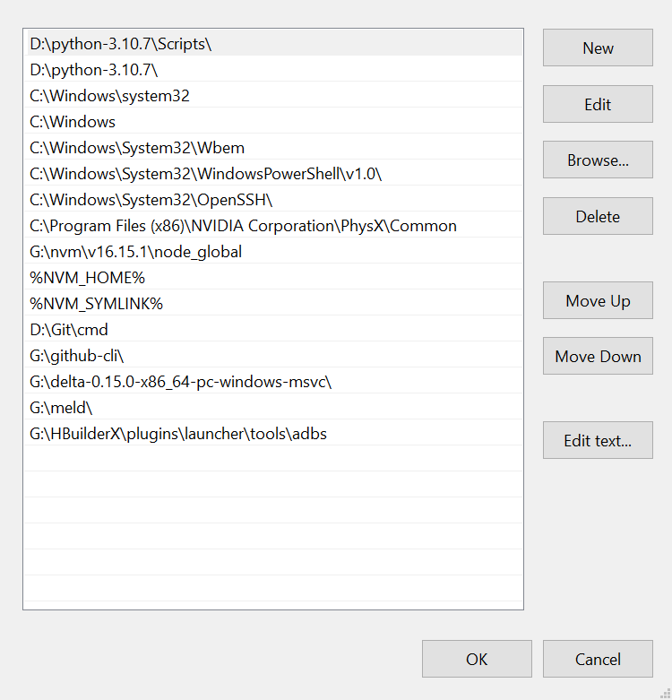

# Note

## 创建项目

- [HBuilderX](https://uniapp.dcloud.net.cn/quickstart-hx.html#%E5%88%9B%E5%BB%BAuni-app)
- [Vue CLI / Vite](https://uniapp.dcloud.net.cn/quickstart-cli.html#install-vue-cli)
- [区别](https://uniapp.dcloud.net.cn/quickstart-cli.html#clidiff)

## HBuilderX 运行项目

### 运行到 H5

### 运行到小程序

### 运行到安卓

- 将 HBuilderX 自带的 adb 配置到全局环境 `Path` 变量中。abd 的路径为 `G:/HBuilderX/plugins/launcher/tools/adbs`。

- 下载安卓模拟器，adb 连接模拟器的端口（不同安卓模拟器的端口各不相同）。命令是 `adb connect <host>:<port>`

- 安卓模拟器运行 uni-app 项目

## App.vue

> Reference: [App.vue](https://uniapp.dcloud.net.cn/collocation/App.html)

`App.vue` 的作用：

- 调用应用的生命周期函数
- 全局数据
- 全局样式

## uni.scss

> Reference: [uni.scss](https://uniapp.dcloud.net.cn/collocation/uni-scss.html)

- 作用：定义一些全局的样式变量，方便在页面中使用，整体控制应用的风格。

## pages.json

> Reference: [pages.json](https://uniapp.dcloud.net.cn/collocation/pages.html)

- 作用：配置所有页面。

## manifest.json

> Reference: [manifest.json](https://uniapp.dcloud.net.cn/collocation/manifest.html)

- 作用：配置应用。

## 跨平台

> Reference: 
> - [uni-app 组成和跨端原理](https://uniapp.dcloud.net.cn/tutorial/)
> - [什么是编译器](https://uniapp.dcloud.net.cn/tutorial/compiler.html)

uni-app 通过编译器和运行时实现跨平台。
- 编译器：将源代码编译为各个平台支持的特有代码。
- 运行时：？

## 条件编译

> Reference: [条件编译处理多端差异](https://uniapp.dcloud.net.cn/tutorial/compiler.html)

- 条件编译：根据注释，将不同代码编译到不同平台。
