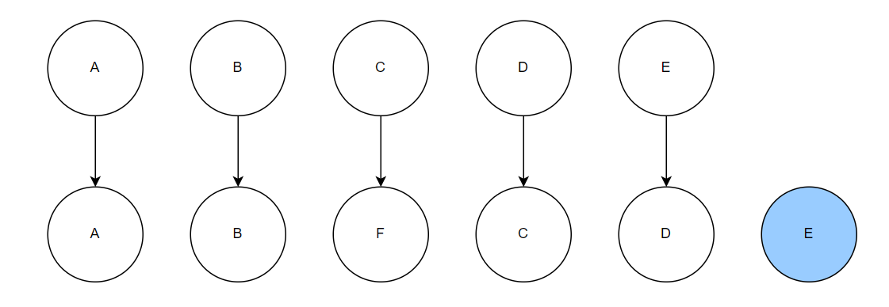
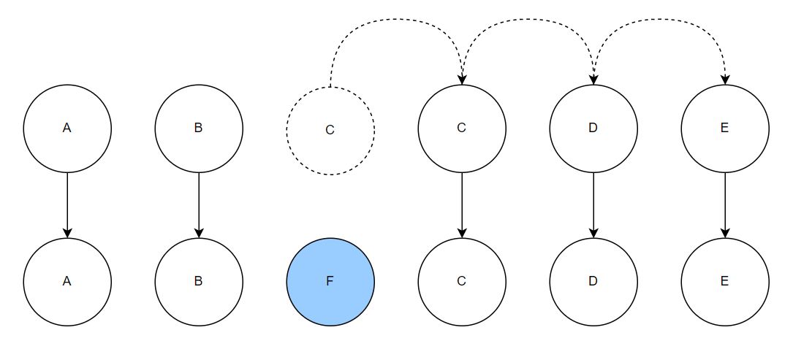

# Key

## What is key

- The `key` special attribute is primarily used as a hint for Vue’s virtual DOM algorithm to identify VNodes when diffing
  the new list of nodes against the old list.

## Why do we need key

- Without keys, Vue uses an algorithm that minimizes element movement and tries to patch/reuse elements of the same type
  in-place as much as possible.
- With keys, it will reorder elements based on the order change of keys, and elements with keys that are no longer
  present will always be removed/destroyed.

## Without Key

```vue
<template>
  <!-- without key -->
  <div v-for="item in items">{{ item }}</div>
</template>

<script setup>
import { ref } from 'vue'

const items = ref(['a', 'b', 'c', 'd', 'e'])
items.value.splice(2, 0, 'f')
</script>
```



1. 比较 A 和 A，数据相同，因此不发生 DOM 操作
2. 比较 B 和 B，数据相同，因此不发生 DOM 操作
3. 比较 C 和 F，数据不相同，因此发生 DOM 操作，C 改为 F
4. 比较 D 和 C，数据不相同，因此发生 DOM 操作，D 改成 C
5. 比较 E 和 D，数据不相同，因此发生 DOM 操作，E 改成 D
6. 将 E 插入到 DOM 中

- 一共执行**三**次更新和一次插入操作

## With Key

```vue
<template>
  <!-- with key -->
  <div
    v-for="item in items"
    :key="item"
  >{{ item }}
  </div>
</template>

<script setup>
import { ref } from 'vue'

const items = ref(['a', 'b', 'c', 'd', 'e'])
items.value.splice(2, 0, 'f')
</script>
```



1. 比较 A 和 A，数据相同，因此不发生 DOM 操作
2. 比较 B 和 B，数据相同，因此不发生 DOM 操作
3. 比较 C 和 F，数据不相同
4. 比较 E 和 E，数据相同，因此不发生 DOM 操作
5. 比较 D 和 D，数据相同，因此不发生 DOM 操作
6. 比较 C 和 C，数据相同，因此不发生 DOM 操作
7. 将 F 插入到 DOM 中

- 一共执行**零**次更新和一次插入操作。（使用 key 可以减少 DOM 操作）

## Refs

- [Vue `key` Attribute](https://vuejs.org/api/built-in-special-attributes.html#key)
- [With and Without Key](https://vue3js.cn/interview/vue/key.html)
