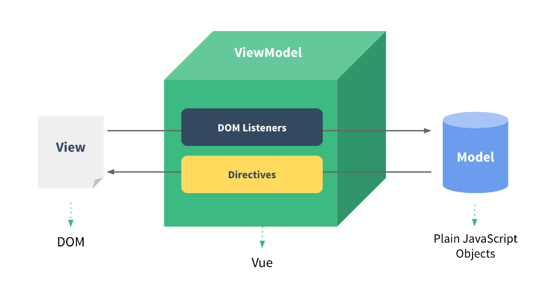

# MVVM

## Definition



- M : Model 模型 (对应 vue 中的 data)
- V : View 视图 (对应 vue 中的 template / render function)
- VM : ViewModel 视图模型 (对应 vue 中的 vue 实例)

```html
<!-- View -->
<div id="app">
  <div>message: {{ message }}</div>
</div>

<script>
  // ViewModel
  const app = new Vue({
    el: '#app',
    // Model
    data: {
      message: 'hello',
    },
  })
</script>
```

## The Rule of ViewModel

- Updates the view after the data in the model changes.
- Changes the data in the model after the view updates.
