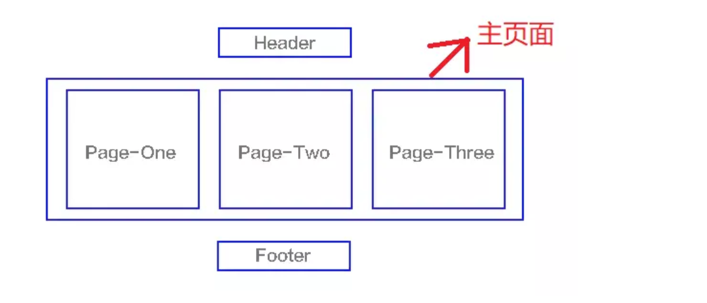
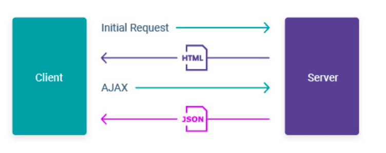
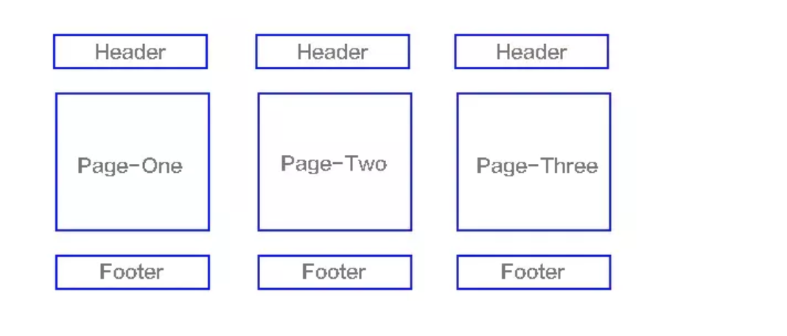
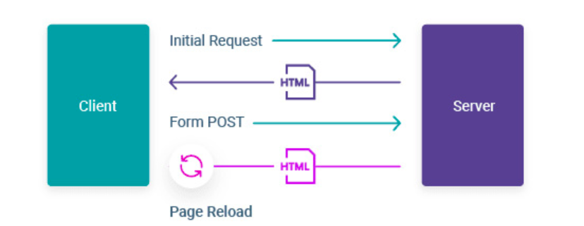

# SPA vs MPA

## Definition

- SPA (Single-Page Application) is a web application or website that interacts with the user by dynamically rewriting
  the current web page with new data from the web server.

- MPA (Multi-Page Application) work in a “traditional” way. Every change eg. display the data or submit data back to
  server requests rendering a new page from the server in the browser.

## Refs

- [Request](https://lvivity.com/single-page-app-vs-multi-page-app)
