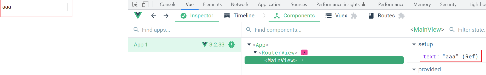

# Two-Way Bindings

## What is two-way bindings

- Developers update the data in the model causes the view to update (model -> view).
- Users update the view causes the data in the model to update (view -> model).
- Being accomplished using the `v-model` directive in Vue.



## Why do we need two-way bindings

- Two-way bindings can significantly speed up your development process.

_with two-way bindings_

```vue
<template>
  <input
    v-model="text"
    type="text"
  >
</template>

<script setup>
import { ref } from 'vue'

const text = ref('')
</script>
```

_without two-way bindings_

```vue
<template>
  <input
    :value="text"
    type="text"
    @input="text = $event.target.value"
  >
</template>

<script setup>
import { ref } from 'vue'

const text = ref('')
</script>
```

## Refs

- [What is Two-way Bindings](https://www.digitalocean.com/community/tutorials/vuejs-v-model-two-way-binding)
