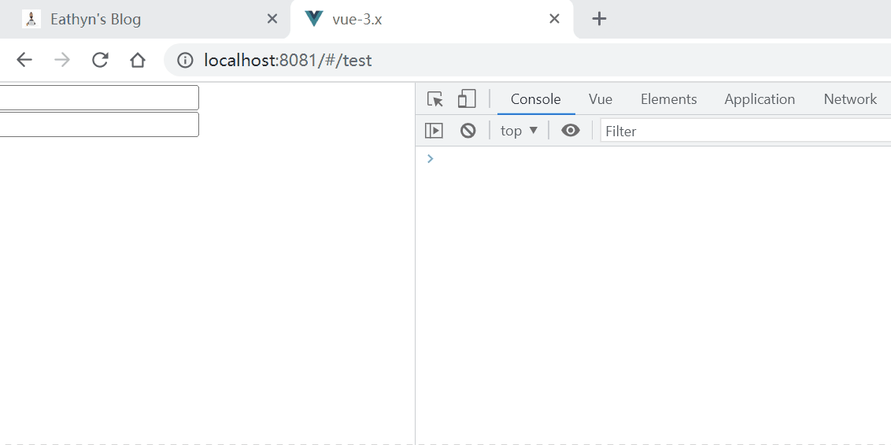

# Using debounce and throttle in Vue.js

## 错误-1：事件处理函数错误

将 `debounceInputEvent` 作为 `input` 的事件处理函数，而不是将 `debounce` 返回的函数作为 `input` 的事件处理函数。因此 `inputEventHandler` 无法运行

```vue
<template>
  <div>
    <input type="text" @input="debounceInputEvent">
  </div>
</template>

<script>
import { debounce } from 'lodash'

export default {
  name: 'InputItem',
  methods: {
    debounceInputEvent() {
      debounce(this.inputEventHandler, 500)
    },
    // 无法运行
    inputEventHandler() {
      console.log('run')
    },
  }
}
</script>
```

## 错误-2：所有实例共享 debounce 返回的函数

因为 `methods` 是所有组件实例共享的，所以多个实例调用的是同一个闭包（即：debounce 返回的函数），内部共享同一个 `timerId`。

```vue
<template>
  <div>
    <input type="text" @input="debounceInputEvent">
  </div>
</template>

<script>
import { debounce } from 'lodash'

export default {
  name: 'InputItem',
  methods: {
    debounceInputEvent: debounce(function inputEventHandler() {
      console.log('run')
    }, 500),
  }
}
</script>
```

_debounce_

```js
function debounce(fn, wait) {
  // 多个组件实例共享同一个 timerId
  let timerId = null

  // 多个组件实例调用同一个闭包
  return function inner(...args) {
    const that = this
    if (timerId) {
      clearTimeout(timerId)
    }
    timerId = setTimeout(function () {
      fn.call(that, ...args)
      timerId = null
    }, wait)
  }
}
```

导致的问题如下：



## 解决方法

因为 `data` 中的数据是不共享的，所以每个组件实例都有一个独立的 `debounce` 函数。因此每个组件实例的 `debounceInputEvent` 保存着不同的闭包（即 `debounce` 返回的函数）和不同的 `timerId`，组件实例之间不会相互影响。

```vue
<template>
  <div>
    <input type="text" @input="debounceInputEvent">
  </div>
</template>

<script>
import { debounce } from 'lodash'

export default {
  name: 'InputItem',
  data() {
    return {
      debounceInputEvent: debounce(this.inputEventHandler, 500)
    }
  },
  methods: {
    inputEventHandler() {
      console.log('run')
    },
  }
}
</script>
```

## Refs

[Debounce and Throttle in Vue](https://dmitripavlutin.com/vue-debounce-throttle/)
