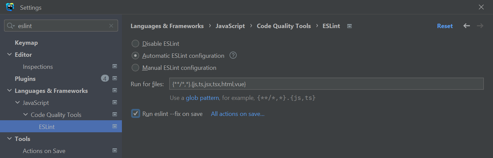

# 搭建 Vue.js 项目

## Vite

### 创建项目

```bash
npm create vite@latest
```

### 配置路径

_vite.config.js_

```js
import { defineConfig } from 'vite'
import vue from '@vitejs/plugin-vue'
import { resolve } from 'path'

// https://vitejs.dev/config/
export default defineConfig({
  plugins: [vue()],
  resolve: {
    alias: {
      '@': resolve(__dirname, 'src'),
    },
    extensions: ['.js', '.json', '.vue'],
  },
  // server: {
  //   proxy: {
  //     '/xxx': {
  //       // ...
  //     }
  //   }
  // }
})
```

_jsconfig.js_

```js
module.exports = {
  compilerOptions: {
    paths: {
      '@/*': ['src/*'],
    },
  },
  exclude: ['node_modules', 'dist'],
}
```

## Vue Router

### 安装

```bash
npm install vue-router@4
```

### 使用

_src/router/index.js_

```js
import { createRouter, createWebHashHistory } from 'vue-router'

const routes = []

const router = createRouter({
  history: createWebHashHistory(),
  routes,
})

export default router
```

## Vuex

### 安装

```bash
npm install vuex@next --save
```

### 使用

_src/store/index.js_

```js
import { createStore } from 'vuex'
import count from '@/store/modules/count.js'

const store = createStore({
  modules: {
    countModule: count,
  },
})

export default store
```

_src/store/modules/count.js_

```js
const count = {
  state() {
    return {
      count: 1,
    }
  },
  getters: {
    doubleCount(state) {
      return state.count * 2
    },
  },
  mutations: {
    INCREMENT(state) {
      state.count++
    },
  },
  actions: {
    increment(context) {
      context.commit('INCREMENT')
    },
  },
}

export default count
```

## Element UI

### 安装

```bash
npm install element-plus --save
```

### 按需引入

#### 安装

```bash
npm install -D unplugin-vue-components unplugin-auto-import
```

#### 配置

_vite.config.js_

```js
import { defineConfig } from 'vite'
import AutoImport from 'unplugin-auto-import/vite'
import Components from 'unplugin-vue-components/vite'
import { ElementPlusResolver } from 'unplugin-vue-components/resolvers'

export default defineConfig({
  // ...
  plugins: [
    // ...
    AutoImport({
      resolvers: [ElementPlusResolver()],
    }),
    Components({
      resolvers: [ElementPlusResolver()],
    }),
  ],
})
```

## ESLint

### 安装 ESLint

```bash
npm i eslint --save-dev
```

### 配置 ESLint

```bash
npm init @eslint/config
```


### Webstorm 设置 ESLint

- 编辑器会提示代码错误的地方
- 保存文件时自动修复错误



## Prettier

### 安装 prettier

```bash
npm i --save-dev prettier
```

### 配置 `.prettierrc.cjs`

```js
module.exports = {
  semi: false,
  singleQuote: true,
  trailingComma: 'all',
  singleAttributePerLine: true,
}
```

### Webstorm 配置 prettier

- 保存和重构文件的时候自动对代码进行格式化


### 处理 ESLint 与 Prettier 的冲突

- 安装 [eslint-config-prettier](https://github.com/prettier/eslint-config-prettier)

```bash
npm install --save-dev eslint-config-prettier
```

- 在 `eslintrc.cjs` 文件的 `extends` 最后添加 `prettier`

```js {5}
module.exports = {
  extends: [
    'plugin:vue/essential',
    'standard',
    'prettier',
  ],
}
```

### 代码风格不符合 Prettier 的配置则在编辑器上显示

#### 背景

默认情况下代码风格与设置的 prettier 规则不符时，不会在编辑器上提示开发者。我们想实现的效果是只要不符则在编辑器上提示开发者，这样可以提前改正一部分代码风格

#### 配置

- 安装 [eslint-plugin-prettier](https://www.npmjs.com/package/eslint-plugin-prettier)

```bash
npm install --save-dev eslint-plugin-prettier
```

- 配置 `.eslintrc.cjs` 的 `plugin` 和 `rules`

```js
module.exports = {
  plugins: ['prettier'],
  rules: {
    'prettier/prettier': 'error'
  },
}
```

#### 效果


## lint-staged

### 原因

- 我们期望的效果是提交代码之前有工具可以帮助我们对代码使用 ESLint 和 Prettier，从而确保代码是符合规范的。那么这里就会有一个问题，我们是否需要对整个项目的代码进行格式化？答案是不需要，因为我们没有必要对之前已经格式化过的代码再一次进行格式化。针对这种情况，我们可以利用 `lint-staged` 只格式化在暂存区中的文件，即修改过的或者新创建的文件。(注意: 如果你的项目最开始没有使用 `ESLint` 和 `Prettier`，我的建议是在安装 `lint-staged` 之前把整个项目的代码用 `ESLint` 和 `Prettier` 格式化一遍，这样可以避免以后修改文件的同时格式化了之前的代码，从而导致提交信息不够准确)

### 配置

- 安装 `lint-staged`

```bash
npm install --save-dev lint-staged
```

- 配置 `package.json`，对暂存区中的文件运行 `ESLint` 和 `Prettier`

```json
{
  "scripts": {
    "lint": "lint-staged"
  },
  "lint-staged": {
    "**/*.{vue,js,cjs,html}": [
      "eslint --fix",
      "prettier --write"
    ]
  }
}
```

- 使用 `git add <file name>` 将文件加入到暂存区之后，使用 `lint-staged` 命令就可以对暂存区中的文件运行 `ESLint` 和 `Prettier`

```bash
npm run lint
```


- 我们期望在提交代码之前可以触发 `lint-staged`，因此可以使用 `pre-commit` 钩子在提交代码之前触发，参考[这里](http://localhost:8080/blog/front_end/attention/config_project/#husky)

## 自定义提交类型

### 原因

- 统一的提交规范可以让开发者快速地明白 commit 的内容，不需要去看详细的代码
- 统一的提交规范可以使用工具自动生成 CHANGELOG

### 方案对比

- 使用 [commitizen/cz-li](https://github.com/commitizen/cz-cli) + [commitizen/cz-conventional-changelog](https://github.com/commitizen/cz-conventional-changelog)，这种方案的缺点是无法自定义 commit 的类型
- 使用 [cz-customizable](https://github.com/leoforfree/cz-customizable)，这种方案可以自定义 commit 类型，推荐使用该方案。这种方案的缺点是不可以把 `package.json` 中的 `type` 设置为 `module`。因为 `cz-customizable` 引用了 `find-config` 包，这个包不支持 ESM，因此读取 `.cz-config.js` 文件的时候会报错，报错信息如下:


### 配置

- 参考[cz-customizable 建议的配置方式](https://github.com/leoforfree/cz-customizable#quick-start-new-recommended)

- 设置 `package.json` 中的 `type` 为 `commonjs`

```json
{
  "type": "commonjs"
}
```

- 安装 `cz-customizable`:

```bash
npm i cz-customizable
```

- 在项目的根目录下创建文件 `.cz-config.js`，并把官方提供的[配置文件](https://github.com/leoforfree/cz-customizable/blob/master/cz-config-EXAMPLE.js)内容复制进去。我结合自己的实际需要和 `conventional-changelog-metahub` 的[提交类型](https://github.com/pvdlg/conventional-changelog-metahub#commit-types)对配置文件进行了修改，最终配置如下所示:

```js
function generateTypeInfo(typeName, explanation) {
  const formattedTypeName = `${typeName}:`.padEnd(12, ' ')
  return `${formattedTypeName}${explanation}`
}

module.exports = {
  types: [
    {
      value: 'feat',
      name: generateTypeInfo('feat', 'A new feature'),
    },
    {
      value: 'fix',
      name: generateTypeInfo('fix', 'A bug fix'),
    },
    {
      value: 'docs',
      name: generateTypeInfo('docs', 'Documentation only changes'),
    },
    {
      value: 'style',
      name: generateTypeInfo(
        'style',
        'Changes that do not affect the meaning of the code (white-space, formatting, missing semi-colons, etc)',
      ),
    },
    {
      value: 'refactor',
      name: generateTypeInfo(
        'refactor',
        'A code change that neither fixes a bug nor adds a feature',
      ),
    },
    {
      value: 'perf',
      name: generateTypeInfo('perf', 'A code change that improves performance'),
    },
    {
      value: 'test',
      name: generateTypeInfo(
        'test',
        'Adding missing tests or correcting existing tests',
      ),
    },
    {
      value: 'build',
      name: generateTypeInfo(
        'build',
        'Changes that affect the build system or external dependencies (gulp, broccoli, npm, etc)',
      ),
    },
    {
      value: 'chore',
      name: generateTypeInfo(
        'chore',
        'Changes to the build process or auxiliary tools and libraries such as documentation generation',
      ),
    },
    {
      value: 'revert',
      name: generateTypeInfo('revert', 'Revert to a commit'),
    },
    {
      value: 'ci',
      name: generateTypeInfo('ci', 'Reverts a previous commit'),
    },
  ],

  messages: {
    type: "Select the type of change that you're committing:",
    scope: '\nDenote the SCOPE of this change (optional):',
    subject: 'Write a SHORT, IMPERATIVE tense description of the change:\n',
    body: 'Provide a LONGER description of the change (optional). Use "|" to break new line:\n',
    breaking: 'List any BREAKING CHANGES (optional):\n',
    footer: 'List any ISSUES CLOSED by this change (optional). E.g.: #31, #34:\n',
    confirmCommit: 'Are you sure you want to proceed with the commit above?',
  },

  // allowBreakingChanges: ['feat', 'fix'],
  skipQuestions: ['scope', 'footer'],
  subjectLimit: 100,
  // footerPrefix : 'ISSUES CLOSED:'
  // askForBreakingChangeFirst : true, // default is false
}
```

- 在 `package.json` 中配置 npm script

```json
{
  "scripts": {
    "cz": "cz-customizable"
  }
}
```

- 运行 `npm run cz`，结果如下图所示


## 检查是否符合提交规范

### 原因

- 我们已经配置完自定义的提交类型，只要通过脚本 `npm run cz` 就可以编写符合规范的提交信息。但是可能团队中的其他开发人员通过 `git commit` 的方式编写提交信息，这样的话就无法确保提交信息符合提交规范，因此我们需要使用一些工具在开发者提交信息的时候检查该提交信息是否符合规范，这里我们需要用到 [commitlint](https://github.com/conventional-changelog/commitlint) 和 `commit-msg` 钩子解决这个问题。

### 配置

- 安装 `commitlint` 相关的包

```bash
npm install --save-dev @commitlint/config-conventional @commitlint/cli
```

- 项目根目录下创建 `commitlint.config.js` 文件，配置继承的规则和定义类型规则，这里的类型规则来源于 `.cz-config.js` 中自定义的规则

```js
const czConfig = require('./.cz-config.js')

const commitTypes = []
czConfig.types.forEach((type) => {
  commitTypes.push(type.value)
})

module.exports = {
  // 继承的规则
  extends: ['@commitlint/config-conventional'],
  // 定义类型规则
  rules: {
    'type-enum': [2, 'always', commitTypes],
    'subject-case': [0],
  },
}
```

- 我们期望的效果是开发者确认提交信息的时候去检查该提交信息是否符合规范，`commit-msg` 钩子就是在这个时刻触发，因此我们可以在 `commit-msg` 钩子中执行 `commitlint`，具体配置看[这里](http://localhost:8080/blog/front_end/attention/config_project/#husky)

## husky

### 原因

- 使用 commit-msg 钩子执行 commitlint
- 使用 pre-commit 钩子执行 lint-staged

### 安装

```bash
npm install husky --save-dev

npx husky install
```

### 配置

#### pre-commit

- create `pre-commit` hook

```bash
npx husky add .husky/pre-commit 'npx lint-staged'
```

#### commit-msg

- create `commit-msg` hook

```bash
npx husky add .husky/commit-msg 'npx --no-install commitlint --edit "$1"'
```
