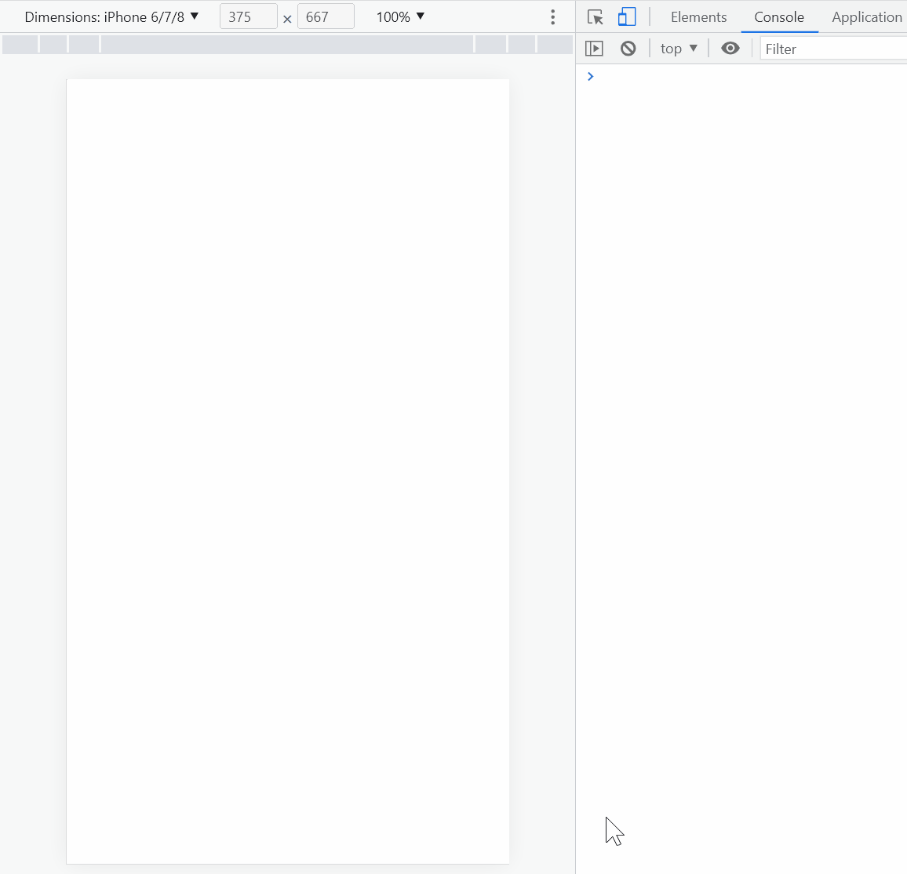

# 图片懒加载

## 原因

_[参考](https://wp-rocket.me/blog/lazyloading/#section-2)_

- 减少网页加载时间
- 减少浏览器的工作
- 减少首页的 HTTP 请求数量
- 减少服务器或 CDN 的压力
- 减少带宽

## Scroll

### 前置知识

_getBoundingClientRect API_

`getBoundingClientRect` 返回一个包含了该元素的一系列信息的对象。我们从这个对象中可以获取到该元素的位置信息，如下图所示，通过 `x`/`left` 属性可以获取到视口左边到元素左边的距离；通过 `y`/`top` 属性可以获取到视口顶边到元素顶边的距离。注意：`x`、`y`、`top`、`left` 都是相对于视口，不是相对于整个文档。如果 `top <= 0`，说明元素的顶边在视口顶边的上方或与视口顶边重合，此时无法看见元素的顶边。如果 `top > 0`，说明元素的顶边在视口中或视口的下方，此时可能可以看到元素的顶边。[link](https://javascript.info/coordinates#element-coordinates-getboundingclientrect)


_window.innerHeight_

- 使用 `window.innerHeight` 可以获取视口的高度。[link](https://javascript.info/size-and-scroll-window#width-height-of-the-window)

_dataset_

- `<div class="test"></div>` 中的 `class` 是标准的属性。开发者可以使用 `data-属性名` 的格式定义非标准的属性，并通过 `dataset` 可以获取非标准属性和对应值。例子如下：

```html
<!-- name 是非标准属性 -->
<div data-name="eathyn" class="test"></div>

<script>
  const div = document.querySelector('div')
  console.log(div.dataset.name) // eathyn
</script>
```

### 原理

使用 `getBoundingClientRect` 获取元素的位置信息；使用 `window.innerHeight` 获取视口高度。对比元素位置信息和视口高度判断出元素的顶边或底边是否出现在视口中。如果元素出现在视口中，则将图片的地址从 `dataset` 中取出，赋值给 `src` 属性，就可以加载图片了。[link](https://javascript.info/onscroll#load-visible-images)

```html

```

```js
// 判断图片是否进入视口
function isVisible(elem) {
  const coords = elem.getBoundingClientRect()
  // 视口高度
  const windowHeight = window.innerHeight
  // 图片的顶边在视图中
  const isTopVisible = coords.top > 0 && coords.top < windowHeight
  // 图片的底边在视图中
  const isBottomVisible = coords.bottom > 0 && coords.bottom < windowHeight
  return isTopVisible || isBottomVisible
}

function loadImage() {
  const lazyImages = document.querySelectorAll('img[data-src]')
  lazyImages.forEach((lazyImage) => {
    // 图片进入视口，加载图片
    if (isVisible(lazyImage)) {
      const realSrc = lazyImage.dataset.src
      lazyImage.src = realSrc
    }
  })
}

loadImage() // 处理页面加载后图片的顶边或底边就出现在视口中的情况
window.addEventListener('scroll', loadImage)
```

### 优化-1 避免重复执行

`loadImage` 可以进行优化。当已下载过的图片重新进入视口时，`isVisible` 返回 `true`，此时会重新从 `dataset` 中获取图片的地址然后赋值给 `src`。虽然不会重新触发 HTTP 请求获取图片，但是这两条语句的执行是没必要的，因为图片在第一次进入视口时已经加载好了。我的解决方案是图片第一次完成下载后就将 `dataset.src` 设置为空字符串，下一次图片进入视口时判断 `dataset.src` 是否为空，如果是空，则跳过。代码如下：

```js
function loadImage() {
  const lazyImages = document.querySelectorAll('img[data-src]')
  lazyImages.forEach((lazyImage) => {
    const realSrc = lazyImage.dataset.src
    // 避免重复执行
    if (!realSrc) {
      return
    }
    // 图片进入视口，加载图片
    if (isVisible(lazyImage)) {
      lazyImage.src = realSrc
      // 图片第一次加载成功后，将 `dataset.src` 设置为空字符串
      lazyImage.dataset.src = ''
    }
  })
}
```

### 优化-2 减小事件频率

`scroll` 事件的触发频率非常高，因此 `loadImage` 函数也会被调用很多次。另外，`loadImage` 中存在 `forEach` 循环，所以最终占用的计算资源会比较高。我的解决方案是降低 `scroll` 事件的触发频率，也就是使用节流。

```js
// 使用 lodash 中的 throttle 函数
window.addEventListener('scroll', _.throttle(loadImage, 200))
```

### 完整代码

[代码链接](https://github.com/Eathyn/lazy-load-image-solutions/tree/main/scroll-event)

_代码_

```html

```

```js
// 判断图片是否进入视口
function isVisible(elem) {
  const coords = elem.getBoundingClientRect()
  // 视口高度
  const windowHeight = window.innerHeight
  // 图片的顶边在视图中
  const isTopVisible = coords.top > 0 && coords.top < windowHeight
  // 图片的底边在视图中
  const isBottomVisible = coords.bottom > 0 && coords.bottom < windowHeight
  return isTopVisible || isBottomVisible
}

function loadImage() {
  const lazyImages = document.querySelectorAll('img[data-src]')
  lazyImages.forEach((lazyImage) => {
    const realSrc = lazyImage.dataset.src
    // 避免重复执行
    if (!realSrc) {
      return
    }
    // 图片进入视口，加载图片
    if (isVisible(lazyImage)) {
      lazyImage.src = realSrc
      // 图片第一次加载成功后，将 `dataset.src` 设置为空字符串
      lazyImage.dataset.src = ''
    }
  })
}

loadImage()
window.addEventListener('scroll', _.throttle(loadImage, 200))
```

## Intersection Observer

### 前置知识

_IntersectionObserver API_

`IntersectionObserver` 可以监听元素是否进入视口。代码如下：当元素进入视口后，在控制台打印 `item entered the viewport`。

```html
<div class="item"></div>

<style>
  .item {
    width: 100px;
    height: 100px;
    background-color: indianred;
    position: absolute;
    top: 800px;
  }
</style>

<script>
  const item = document.querySelector('.item')
  const observer = new IntersectionObserver((entries) => {
    entries.forEach((entry) => {
      if (entry.isIntersecting) {
        console.log('item entered the viewport')
      }
    })
  })
  observer.observe(item)
</script>
```



`IntersectionObserver` 还可以设置 `threshold`、`rootMargin`、`root` 选项，详细可看这篇[文章](https://blog.webdevsimplified.com/2022-01/intersection-observer/)。

### 原理

使用 `intersectionObserver` 监视图片是否进入视口。图片进入视口后，通过 `dataset.src` 获取图片的 URL 并加载图片。代码如下：

```html


<script>
  const observer = new IntersectionObserver(
    (entries) => {
      entries.forEach((entry) => {
        // 图片进入视口
        if (entry.isIntersecting) {
          // 加载图片
          const lazyImage = entry.target
          lazyImage.src = lazyImage.dataset.src
        }
      })
    },
  )

  const images = document.querySelectorAll('img[data-src]')
  images.forEach((image) => observer.observe(image))
</script>
```

### 优化-1 避免重复执行

已加载的图片重新进入视口时，没有必要执行如下的代码：

```js
const lazyImage = entry.target
lazyImage.src = lazyImage.dataset.src
```

因为图片第一次进入视口时就已经加载好图片了。`IntersectionObserver` 提供了 `unobserve` 方法，用于取消监视元素。我们可以利用这个方法，当图片进入视口并加载完图片后，取消监视这个图片元素。那么这个图片元素重新进入视口时就不会调用 `IntersectionObserver` 的回调函数。代码如下：


```js
const observer = new IntersectionObserver(
  (entries, observer) => {
    entries.forEach((entry) => {
      // 图片进入视口
      if (entry.isIntersecting) {
        // 加载图片
        const lazyImage = entry.target
        lazyImage.src = lazyImage.dataset.src
        // 避免重复执行
        observer.unobserve(lazyImage)
      }
    })
  },
)
```

### 完整代码

[代码链接](https://github.com/Eathyn/lazy-load-image-solutions/tree/main/intersection-observer-api)

```html

```

```js
const observer = new IntersectionObserver(
  (entries, observer) => {
    entries.forEach((entry) => {
      // 图片进入视口
      if (entry.isIntersecting) {
        // 加载图片
        const lazyImage = entry.target
        lazyImage.src = lazyImage.dataset.src
        // 避免重复执行
        observer.unobserve(lazyImage)
      }
    })
  },
)

const images = document.querySelectorAll('img[data-src]')
images.forEach((image) => observer.observe(image))
```

## Loading Attribute

### 原理

将 `img` 元素的 `loading` 属性的值设置为 `lazy` 也可以实现图片懒加载，但是这个属性值的浏览器兼容性目前比较差，可参考 [can I use](https://caniuse.com/?search=lazy)。

### 完整代码

[代码链接](https://github.com/Eathyn/lazy-load-image-solutions/tree/main/native-attribute)

```html

```

## Libraries

[lozad.js](https://github.com/ApoorvSaxena/lozad.js)

## Custom Plugin and Directive in Vue

[源码](https://github.com/Eathyn/lazy-load-image-solutions/tree/main/vue-plugin)

### 前置知识

- vue plugin
- vue custom directive

### 原理

如果使用 Vue.js 作为框架，那么可以使用插件进行封装，方便在多个组件中使用。

在插件中，我创建了自定义指令 `v-lazy`。在 `created` 钩子中设置真实图片的 URL 和占位符图片；在 `mounted` 钩子中根据浏览器的兼容性，使用 `IntersectionObserver` 或滚动事件处理图片懒加载问题。代码如下：

```js
const lazyLoad = {
  install(app, options) {
    const placeholderImg = options.placeholderImg

    app.directive('lazy', {
      // 设置真实图片的 URL 和占位符图片
      created(el, binding) {
        const realImgSrc = binding.value
        el.setAttribute('data-src', realImgSrc)
        el.setAttribute('src', placeholderImg)
      },
      // 根据浏览器的兼容性，使用 `IntersectionObserver` 或滚动事件处理图片懒加载问题
      mounted() {
        if (IntersectionObserver) {
          lazyLoad.observe()
        } else {
          lazyLoad.loadImage()
          window.addEventListener('scroll', throttle(lazyLoad.loadImage, 200))
        }
      },
    })
  },
}
```

### 基本使用

```vue
<template>
  
</template>
```

## Refs

- [Why Should You Use Lazy Loading to Make Images Load Faster](https://wp-rocket.me/blog/lazyloading/#section-2)
- [getBoundingClientRect API](https://javascript.info/coordinates#element-coordinates-getboundingclientrect)
- [window.innerHeight](https://javascript.info/size-and-scroll-window#width-height-of-the-window)
- [图片懒加载：scroll 方案](https://javascript.info/onscroll#load-visible-images)
- [IntersectionObserver API](https://blog.webdevsimplified.com/2022-01/intersection-observer/)
- [Loading attribute](https://developer.mozilla.org/en-US/docs/Web/HTML/Element/img#attr-loading)
- [v-lazy Directive](https://juejin.cn/post/6903774214780616718#heading-3)
