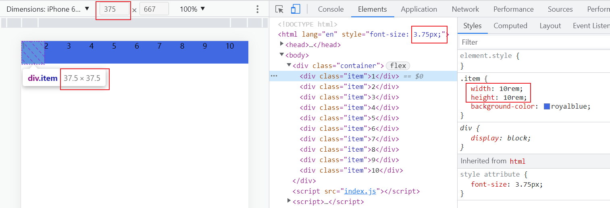
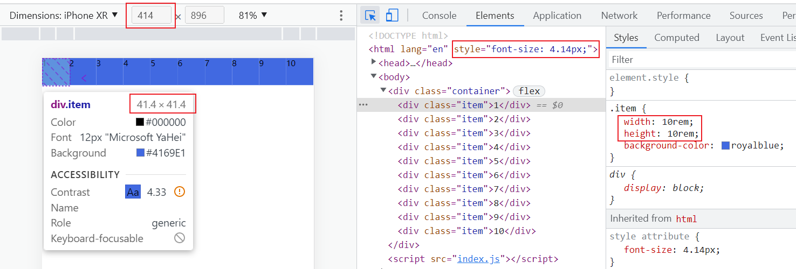
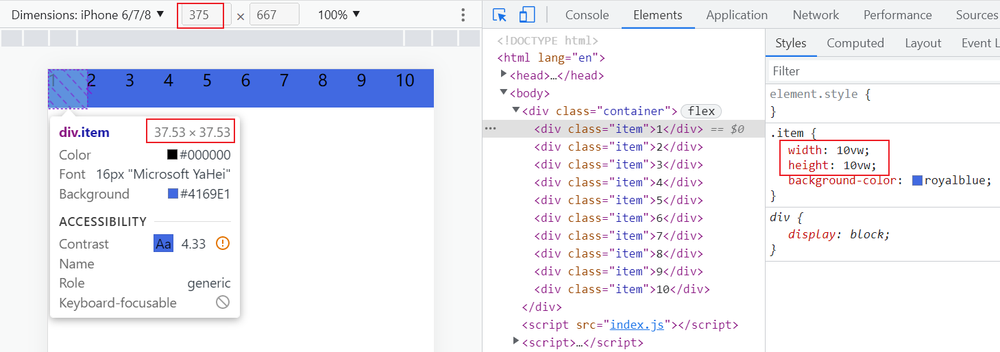
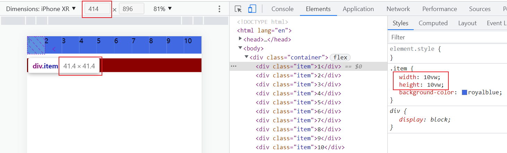
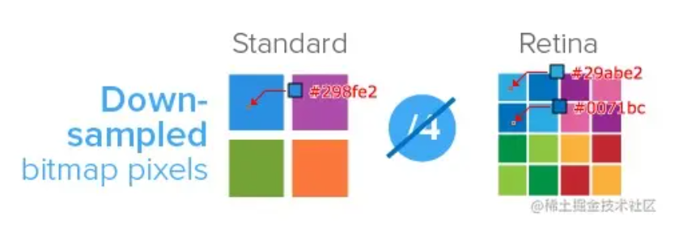
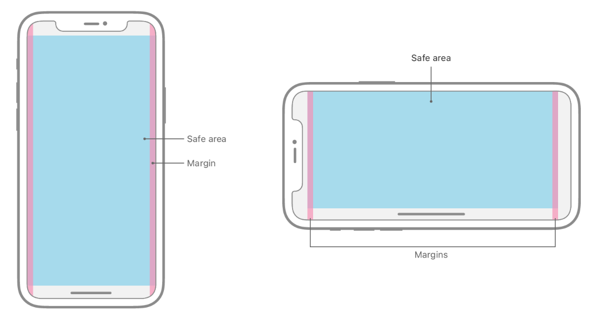

# 移动端屏幕适配

## 技术名词

- 设备像素（Device Pixels）/ 物理像素（Physical Pixels）：物理设备水平和垂直方向上的像素
- 设备独立像素（Density-Independent Pixels）/ 逻辑像素（Logical Pixels）：在浏览器里看到的那个像素
- 设备像素比（Device Pixel Ratio）：设备像素 ÷ 设备独立像素
- CSS 像素：设备独立像素 * 缩放比例
- PPI（Pixel Per Inch）：每英寸包含的设备像素数。用于描述图片或屏幕的清晰度，越高越清晰
- DPI（Dot Per Inch）：每英寸包含的点。一般用于打印机的墨点

## 解决方案-1: Rem

[源码](https://github.com/Eathyn/mobile-screen-adapation-solution/tree/rem)

### 原理

- 将 `html` 的 `font-size` 设置为屏幕宽度的百分之一。因为 `rem` 相对于 html 的 `font-size`，所以 `rem` 等于屏幕宽度的百分之一。此时 `10rem` 在**不同**屏幕下都表示屏幕宽度的百分之十，解决了适配问题。
- 因为设计师给开发者的设计稿的尺寸单位都是 `px`，所以需要把 `px` 转化为 `rem`。使用 `postcss` 的插件 `postcss-pxtorem` 可以将 `px` 自动转化为 `rem`，开发者不需要自己计算。

### 代码解析

通过 `document.documentElement.clientWidth` 获取屏幕宽度，将 `html` 的 `font-size` 设置为屏幕宽度的百分之一。

```js
const htmlEle = document.documentElement
const screenWidth = htmlEle.clientWidth
htmlEle.style.fontSize = `${screenWidth / 100}px`
```

配置 `postcss-pxtorem` 插件的选项，因为设计师给开发者的设计稿是 `iPhone 6`，`iPhone 6` 的屏幕尺寸是 `375 * 667` px，并且我将 `rem` 设置为屏幕的宽度的百分之一，所以 `rootValue` 选项的值为 `3.75`（375 / 100）。更多选项配置参考[插件文档](https://github.com/cuth/postcss-pxtorem#options)。

```js
// postcss.config.js
module.exports = {
  plugins: [
    require('postcss-pxtorem')({
      rootValue: 3.75,
      propList: ['*'],
      exclude: /node_modules/,
    }),
  ],
}
```

### 效果图

如 `图-1` 所示，因为 iPhone-6 的屏幕宽度为 `375` px，所以 `html` 的 `font-size` 为 `3.75`（375 / 100）px。另外可以看到 `.item` 类的单位使用了 `rem`，说明了 `postcss-pxtorem` 自动将 `px` 转化成 `rem`。



---

如 `图-2` 所示，因为 iPhone-XR 的屏幕宽度为 `414` px，所以 `html` 的 `font-size` 为 `4.14`（414 / 100）px。



## 解决方案-2: VW

[源码](https://github.com/Eathyn/mobile-screen-adapation-solution/tree/main)

### 原理

- `vw` 相当于屏幕宽度的百分之一，因此 `10vw` 在**不同**屏幕下都表示屏幕宽度的百分之十，解决了适配问题。
- 因为设计师给开发者的设计稿的尺寸单位都是 `px`，所以需要把 `px` 转化为 `vw`。使用 `postcss` 的插件 `postcss-px-to-viewport` 可以将 `px` 自动转化为 `vw`，开发者不需要自己计算。

### 代码解析

配置 `postcss-px-to-viewport` 插件的选项，因为设计师给开发者的设计稿是 `iPhone 6`，`iPhone 6` 的屏幕尺寸是 `375 * 667` px，所以 `viewportWidth` 选项的值为 `375`。更多选项配置参考[插件文档](https://github.com/evrone/postcss-px-to-viewport)。

```js
// postcss.config.js
module.exports = {
  plugins: {
    'postcss-px-to-viewport': {
      unitToConvert: 'px',
      viewportWidth: 375,
      unitPrecision: 5,
      propList: ['*'],
      viewportUnit: 'vw',
      fontViewportUnit: 'vw',
      selectorBlackList: [],
      minPixelValue: 1,
      exclude: /node_modules/,
    },
  }
}
```

### 效果图

如 `图-3` 所示，因为 iPhone-6 的屏幕宽度为 `375` px，所以小方块的宽度为 `37.5` px 即 `10` vw。另外可以看到 `.item` 类的单位使用了 `vw`，说明了 `postcss-px-to-viewport` 自动将 `px` 转化成 `vw`。



---

如 `图-4` 所示，因为 iPhone-XR 的屏幕宽度为 `414` px，所以小方块的宽度为 `41.4` px 即 `10` vw。



### 注意

`postcss-px-to-viewport` 插件与 `postcss 8` 搭配使用时会出现如下警告：

> postcss-px-to-viewport: postcss.plugin was deprecated. Migration guide: https://evilmartians.com/chronicles/postcss-8-plugin-migration

将 `postcss-px-to-viewport` 插件更换为 `postcss-px-to-viewport-8-plugin` 可以避免上述问题。

[源码](https://github.com/Eathyn/mobile-screen-adapation-solution/tree/vw-fix)

## 产生的问题和解决方案

### 1px

当你想画一条 1px **物理**像素的线时，你可能会这么实现：

```css
.item {
  border-bottom: 1px solid #000;
}
```

但这是错误的，因为上述代码的 1px 是**逻辑**像素。在 DPR = 2 的设备中，1px 逻辑像素等于 2px 物理像素；在 DPR = 3 的设备中，1px 逻辑像素等于 3px 物理像素。也许你的解决方案是获取设备的 DPR，然后 1px 物理像素就可以用 `1px / DPR` 表示：

```js
const DPR = Math.round(window.devicePixelRatio)
const onePhysicalPixel = `${1 / DPR}px`
const item = document.querySelector('.item')
item.style.backgroundColor = '#000'
item.style.height = `${onePhysicalPixel}`
```

这种方法在如今大部分机型上表现都正常，但是在 IOS-8 以下的系统或者低版本的安卓机上会把低于 1px 的像素转化为 0px。为了兼容低版本的设备，有以下方法：

- transform 缩放（[源码](https://github.com/Eathyn/1px-solution/tree/transform-scale)）。代码如下：

> [src/css/index.css](https://github.com/Eathyn/1px-solution/blob/transform-scale/src/css/index.css)

```css {3,6-10,12-16}
.line {
	height: 1px;
	transform-origin: 50% 0;
}

@media only screen and (-webkit-device-pixel-ratio: 2) {
	.line {
		transform: scaleY(calc(1 / 2));
	}
}

@media only screen and (-webkit-device-pixel-ratio: 3) {
	.line {
		transform: scaleY(calc(1 / 3));
	}
}
```

- 设置 meta 元素的 viewport 缩放，让逻辑像素等于物理像素（[源码](https://github.com/Eathyn/1px-solution/tree/viewport-scale)）。代码如下：

> [src/main.js](https://github.com/Eathyn/1px-solution/blob/viewport-scale/src/main.js)

```js
const DPR = Math.round(window.devicePixelRatio)
const scale = 1 / DPR
const meta = document.querySelector('meta[name="viewport"]')
if (!meta) {
  const meta = document.createElement('meta')
  meta.setAttribute('name', 'viewport')
}
meta.setAttribute('content', `
  width=device-width,
  initial-scale=${scale},
  minimum-scale=${scale},
  user-scalable=no
`)
```

### 图片模糊

图片是由像素组成，如果一个图片像素使用一个物理像素渲染，就可以达到最佳的显示效果。但是在 DPR 等于 2 或 3 的屏幕中，一个图片像素使用四个（DPR=2）或九个（DPR=3）物理像素渲染，导致物理像素点不能被分配上准确的颜色，那么就会出现图片模糊的情况。如下图所示：



因此我们针对不同 DPR 的屏幕，展示不同分辨率的图片。解决方式有：

- 媒体查询，适用于背景图片（[源码](https://github.com/Eathyn/image-adaptation/tree/media-query)）。代码如下：

```css
.item {
	width: 300px;
	height: 200px;
	background-image: url("../images/car@1x.jpg");
	background-repeat: no-repeat;
	background-size: cover;
}

@media only screen and (-webkit-device-pixel-ratio: 2) {
	.item {
		background-image: url("../images/car@2x.jpg");
	}
}

@media only screen and (-webkit-device-pixel-ratio: 3) {
	.item {
		background-image: url("../images/car@3x.jpg");
	}
}
```

- image-set，适用于背景图片（[源码](https://github.com/Eathyn/image-adaptation/tree/image-set)）。代码如下：

> [src/main.css](https://github.com/Eathyn/image-adaptation/blob/image-set/src/main.css)

```css
.item {
	width: 300px;
	height: 200px;
	background-image: image-set(
		url("../images/car-150by100.jpg") 1x,
		url("../images/car-300by199.jpg") 2x,
		url("../images/car-640by425.jpg") 3x
	);
	background-image: -webkit-image-set(
		url("../images/car-150by100.jpg") 1x,
		url("../images/car-300by199.jpg") 2x,
		url("../images/car-640by425.jpg") 3x
	);
	background-repeat: no-repeat;
	background-size: cover;
}
```

- srcset，适用于图片（[源码](https://github.com/Eathyn/image-adaptation/tree/srcset)）。代码如下：

```html {3,4}

```

- svg，适用于图片或背景图片

### 安全区适配

> Ref: [安全区适配](https://mp.weixin.qq.com/s/Z5d1Aulc7qa-1J_SqDWgaQ)

[源码](https://github.com/Eathyn/solution-safe-area)

安全区：排除手机屏幕的圆角、刘海和小黑条的可视窗口。如图所示：



想要将网页限制在安全区中，需要如下步骤：
- `meta` 元素中设置 `viewport-fit=cover`
- `padding` 或 `margin` 设置 `constant(safe-area-inset-bottom)`。适用于 IOS 版本 < 11.2 的情况。
- `padding` 或 `margin` 设置 `env(safe-area-inset-bottom)`。适用于 IOS 版本 >= 11.2 的情况。
- `constant` 的位置需要 `env` 上面。

> [public/index.html](https://github.com/Eathyn/solution-safe-area/blob/main/public/index.html)

```html {9}
<meta
  name="viewport"
  content="
    width=device-width,
    initial-scale=1,
    maximum-scale=1,
    minimum-scale=1,
    user-scalable=no,
    viewport-fit=cover
  "
>
```

> [src/css/index.css](https://github.com/Eathyn/solution-safe-area/blob/main/src/css/index.css)

```css
body {
	padding-top: constant(safe-area-inset-top);
	padding-top: env(safe-area-inset-top);

	padding-bottom: constant(safe-area-inset-bottom);
	padding-bottom: env(safe-area-inset-bottom);

	padding-left: constant(safe-area-inset-left);
	padding-left: env(safe-area-inset-left);

	padding-right: constant(safe-area-inset-right);
	padding-right: env(safe-area-inset-right);

	margin: 0;
}
```

很多 Android 手机也会按照 iOS 的标准来实现安全区域，因此上面的属性在大部分 Android 手机上也能正常使用。

## Refs

- [技术名词和解决方案](https://www.zhihu.com/question/63663871/answer/2439525582)
- [图片模糊的原因和解决方案](https://juejin.cn/post/6844903845617729549#heading-37)
- [移动端安全区处理](https://juejin.cn/post/6844903845617729549#heading-30)
- [微信小程序和 H5 的安全区处理](https://juejin.cn/post/6844904106088202254)
