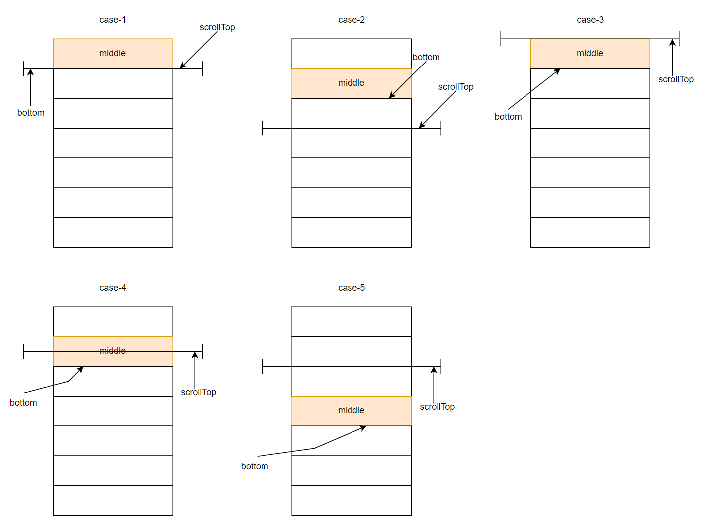

# 虚拟滚动

## 原因

一次性渲染大量 DOM 操作时，浏览器花费太多时间渲染 DOM，导致白屏甚至无响应。

## 实现原理

不要一次性渲染所有 DOM，只渲染当前屏幕里显示的元素的 DOM。那么关键就是确定要显示的元素的开始索引和结束索引。

通过 `scroll` 事件获取 `scrollTop`。通过 `scrollTop` 计算可视区的开始索引（`start`）和结束索引（`end`）。

```js
// 滚动事件处理函数
function scrollEventHandler() {
  // 当前滚动位置
  let scrollTop = this.$refs.list.scrollTop
  // 此时的开始索引
  this.start = this.getStartIndex(scrollTop)
  // 此时的结束索引
  this.end = this.start + this.visibleCount
}
```

计算获取开始索引：通过 `getStartIndex` 获取开始索引。`getStartIndex` 的实现可以是将 `scrollTop` 和每一个列表项进行对比，那么时间复杂度是 `O(n)`。因为列表项的 `bottom` 是从上到下是升序的，所以采用二分查找可以将时间复杂度降低为 `O(logN)`。一共有五种情况，代码和图示如下：

```js
// 获取列表起始索引
function getStartIndex(scrollTop = 0) {
  const startIndex = this.binarySearch(this.positions, scrollTop)
  if (startIndex >= 0) {
    return startIndex
  } else {
    console.error('binary search has some errors')
  }
}

// 使用二分查找将时间复杂度降低为 O(logN)
function binarySearch(positions, scrollTop) {
  let start = 0
  let end = positions.length - 1

  while (start <= end) {
    const middle = Math.floor((start + end) / 2)
    if (positions[middle].bottom === scrollTop) {
      // case-1：scrollTop 等于某一列表项的 bottom，说明可视区的第一项是该列表项的下一项
      return middle + 1
    } else if (positions[middle].bottom < scrollTop) {
      // case-2：缩小范围，继续计算
      start = middle + 1
    } else if (positions[middle].bottom > scrollTop) {
      // case-3：开始索引是第一项
      if (middle === 0) {
        return middle
      }
      // case-4：屏幕中的第一项只显示一部分，另一部分在 scrollTop 中
      if (positions[middle - 1].bottom < scrollTop) {
        return middle
      }
      // case-5：缩小范围，继续计算
      end = middle - 1
    }
  }

  return -1
}
```



动态高度处理方式：
- 滚动鼠标滚轮时会触发 `scroll` 事件处理函数，在 `scroll` 事件处理函数中会改变开始索引 `start`。因为 `visibleData` 是基于 `start` 的 `computed` 属性，且 `visibleData` 绑定到 `template` 中，所以 `visibleData` 改变后会触发 `updated` 钩子函数。
- 因为想要获取到渲染后的列表项的实际高度，所以需要在 `updated` 钩子函数中处理动态高度问题，并使用 `nextTick`。
- 在 `updated` 钩子函数中调用 `updateItemSize` 函数，该函数使用 `getBoundingClientRect` 获取每个列表项的当前高度等位置信息，然后计算出当前高度与预估高度之间的差值，最后更新列表项和该列表项下所有列表的位置信息，最后更新列表总高度。代码如下：

```js
function updated() {
  this.$nextTick(function() {
    if (!this.$refs.items || this.$refs.items.length === 0) {
      return
    }
    this.updateItemsSize()
    // 更新列表总高度
    let height = this.positions[this.positions.length - 1].bottom
    this.$refs.phantom.style.height = height + 'px'
  })
}

// 获取真实元素大小，更新列表项的高度等各项信息
function updateItemsSize() {
  const nodes = this.$refs.items
  nodes.forEach((node) => {
    const rect = node.getBoundingClientRect()
    const height = rect.height
    const index = Number(node.id.slice(1))
    const oldHeight = this.positions[index].height
    const dValue = oldHeight - height
    // 如果存在差值，则更新列表项的高度等各项信息
    if (dValue) {
      // 更新列表项的 bottom 和 height，top 不变
      this.positions[index].bottom = this.positions[index].bottom - dValue
      this.positions[index].height = height
      // 更新该列表项下面所有列表项的 top 和 bottom，height 不变
      for (let k = index + 1; k < this.positions.length; k++) {
        this.positions[k].top = this.positions[k - 1].bottom
        this.positions[k].bottom = this.positions[k].bottom - dValue
      }
    }
  })
}
```

移动列表项父元素的位置：因为鼠标滚轮向下滚动时，包含列表项的父元素也会向上移动，所以需要使用 `transform: translate3d` 向下移动该元素的位置。代码如下：

```js
function setStartOffset() {
  let startOffset
  if (this.start >= 1) {
    let size = this.positions[this.start].top -
      (this.positions[this.start - this.aboveCount] ? this.positions[this.start - this.aboveCount].top : 0)
    startOffset = this.positions[this.start - 1].bottom - size
  } else {
    startOffset = 0
  }
  // 鼠标滚轮向下滚动时，包含列表项的父元素也会向上移动，因此需要使用 `transform: translate3d` 向下移动该元素的位置
  this.$refs.content.style.transform = `translate3d(0, ${ startOffset }px, 0)`
}
```

## 优化-1

使用节流限制 `scroll` 事件的执行频率，或者使用 `IntersectionObserver` API。

## 优化-2

如果列表项中存在图片，且图片的高度决定了列表项的高度。可以使用 `ResizeObserver` API 进行监听。

## 完整代码地址

[Virtual Scrolling in GitHub](https://github.com/Eathyn/virtual-scrolling)

## Refs

[Virtual Scrolling](https://juejin.cn/post/6844903982742110216)
