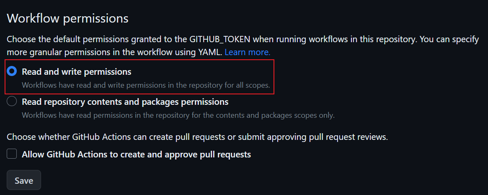
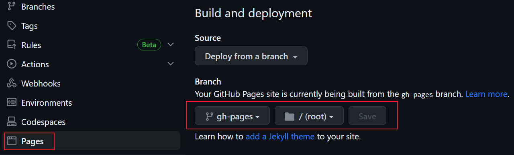

# Create Blog

## 创建项目

- 使用 [vuepress hope](https://theme-hope.vuejs.press/zh/cookbook/tutorial/) 在本地创建博客项目。

## 推送项目

- 在 Github 上新建仓库，并把本地仓库推送到远程仓库上。

## 部署项目

### 更改仓库权限

- 推送后会自动触发部署。但是会报以下错误：

```text
Error: The deploy step encountered an error: The process '/usr/bin/git' failed with exit code 128
```

- 解决方法是更改仓库设置。在 `Settings/Actions/General` 的 `Workflow permissions` 中将权限改为 `Read and write permissions`。



### 更改分支和文件

- 在 `Settings/Pages` 将分支设置为 `gh-pages`，文件设置为 `/(root)`。



::: tip
GitHub 只有企业版才可以将私有仓库部署到 GitHub Page。
:::
