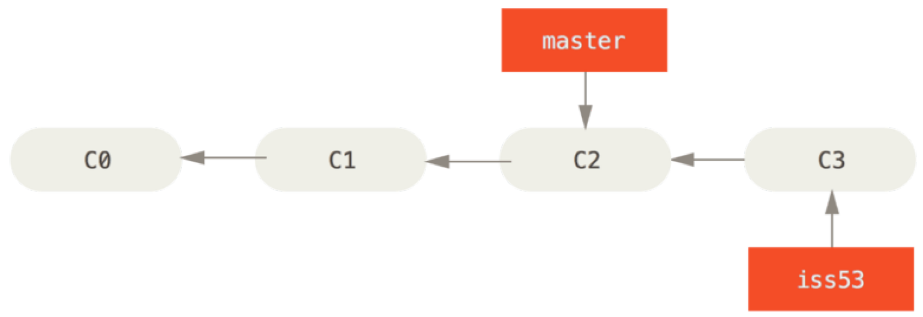
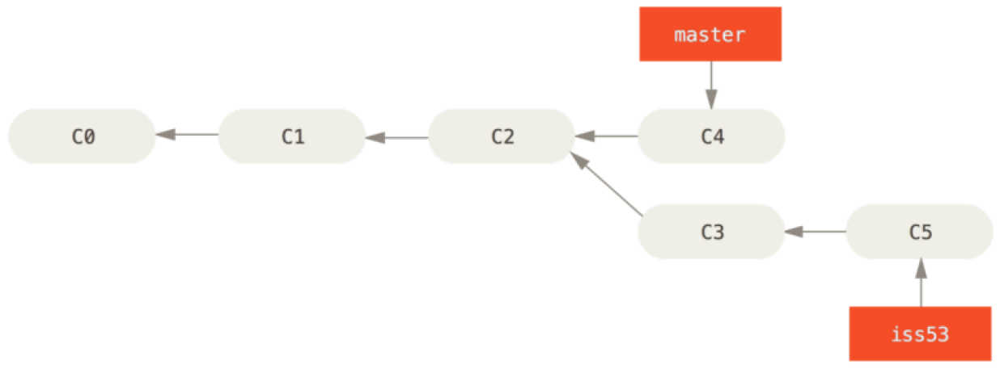
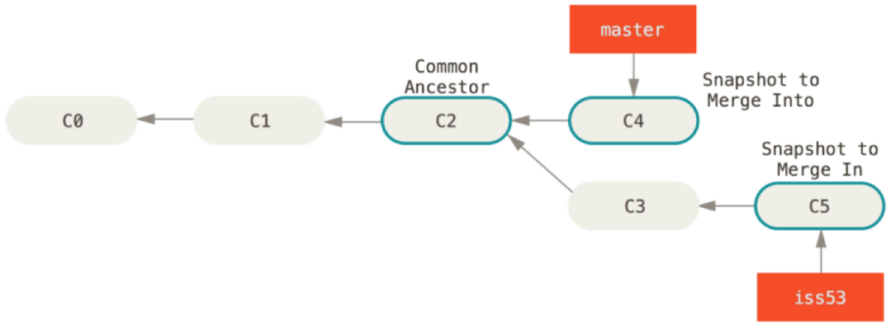
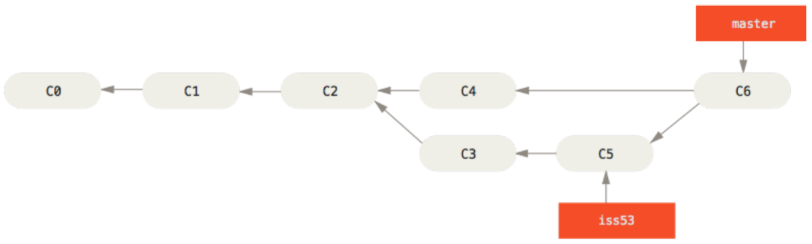
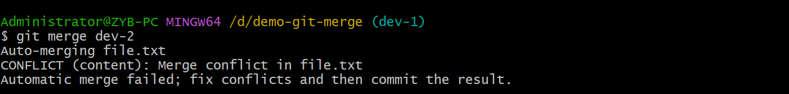
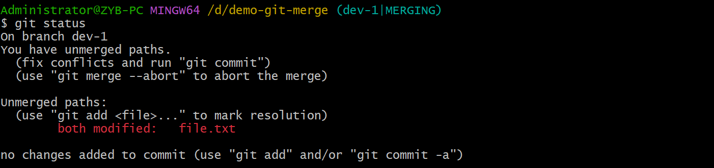
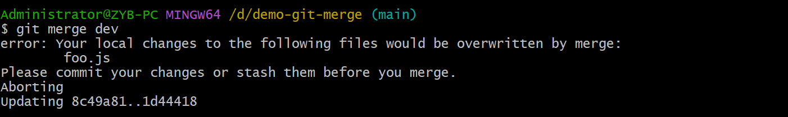
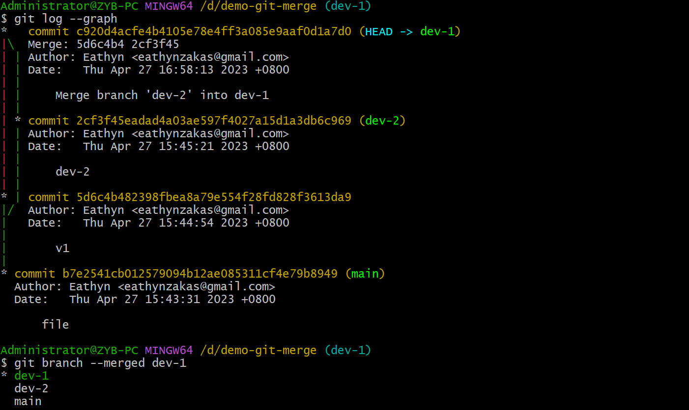
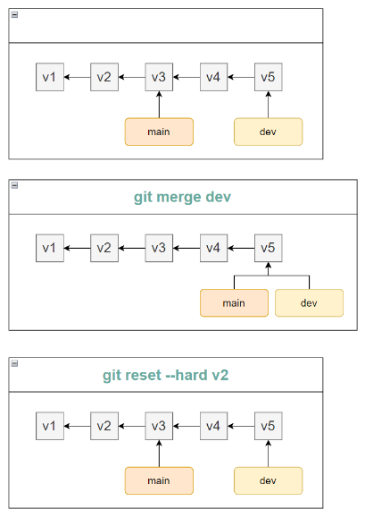
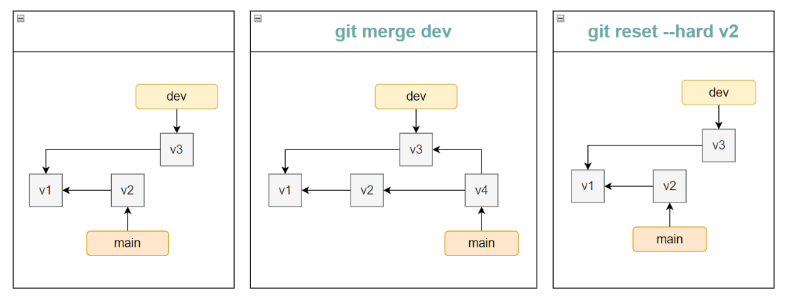

# Merge

## Fast-Forward Merge

> - [blog: fast-forward merge](https://www.atlassian.com/git/tutorials/using-branches/git-merge#:~:text=Fast%20Forward%20Merge,to%20the%20target%20branch%20tip.)
> - Pro Git: p69 - p72

### 概念

快进合并（fast-forward merge）指的是当前分支的顶端可以通过一条线性的路径直接到达目标分支。

### 例子

master 合并 iss53 时可以快速合并，因为 master 的顶端（C2）可以通过一条线性的路径直接到达目标分支（iss53）。



master 合并 iss53 时无法快速合并，因为 master 的顶端（C2）无法通过一条线性的路径直接到达目标分支（iss53）。



## Three-Way Merge

### 概念

- 三方合并（three-way merge）指的是生成一个新的 commit，这个 commit 连接两个分支。

- 三方指的是：两个分支最新的 commit 和它们共同的祖先 commit。

### 例子

- master 合并 iss53 时无法快速合并，因为 master 的顶端（C2）无法通过一条线性的路径直接到达目标分支（iss53）。只能使用三方合并。



- 利用 C2、C4 和 C5 生成 C6。



## Merge Conflict

- 执行三方合并时，如果两个分支有相同文件且内容冲突，那么分支合并时就会冲突。




- 执行 `git status` 可以定位到产生冲突的文件。



- `<<<<<<<` 至 `=======` 表示当前分支（HEAD）与被合并分支（dev-2）冲突的内容。`=======` 至 `>>>>>>>` 表示被合并分支与当前分支冲突的内容。

```text
<<<<<<< HEAD
hello world
=======
hi world
>>>>>>> dev-2
```

- 编辑文件解决冲突之后需要提交 commit。

- 合并其他分支时，如果当前分支的 working directory 有内容，Git 会自动放弃合并，并提示你先 commit 或 stash。



## Check Merged and No-Merged

### Merged

```git branch --merged <branch-name>``` 可以查看有哪些分支已经合并到某个分支。例子如下：

`dev-1` 来源于 `main`，所以 `main` 相当于已经合并到 `dev-1` 分支。`dev-2` 已经手动合并到 `dev-1`，所以也显示了出来。



### No-Merged

```git branch --no-merged <branch-name>``` 可以查看有哪些分支未合并到某个分支。

## 取消合并

执行 `git merge --abort`，分支会恢复为原来的内容。

```text
# 放弃合并前
<<<<<<< HEAD
hello world
=======
hi world
>>>>>>> dev-2

# 放弃合并后
hello world
```

## undo merge

- 如果合并分支之后发现合并了错误的分支，想要让分支恢复为合并之前的内容。这时分为两种情况，如果合并后的分支还没有推送到远程仓库，则使用 `reset`；如果已经推送到远程仓库，则使用 `revert`。

### 未推送到远程仓库

> Pro Git: p283 - p285

- 如果合并后的分支没有推动到远程仓库且是 `fast-forward` 合并，则使用 `reset` 回退到特定的 commit。



- 如果合并后的分支没有推动到远程仓库且是三方合并，则使用 `reset` 回退一个 commit（三方合并会产生额外的 commit）。



### 已推送到远程仓库
