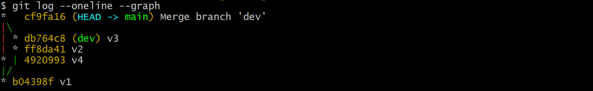
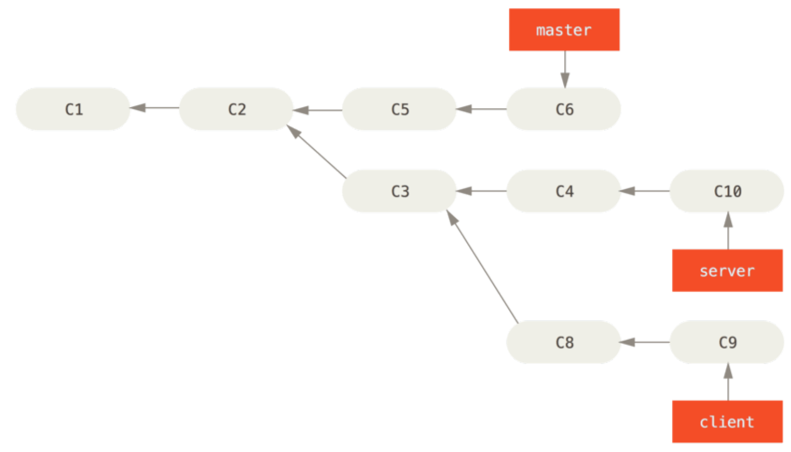
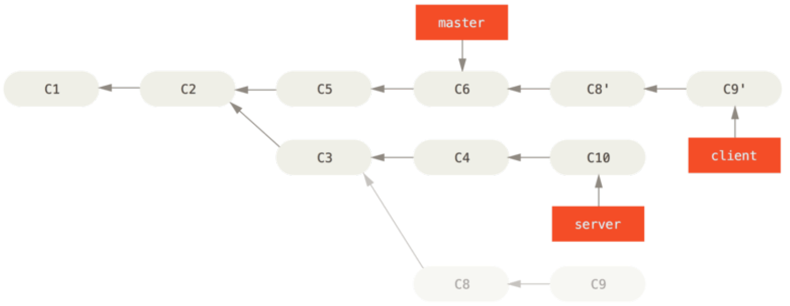
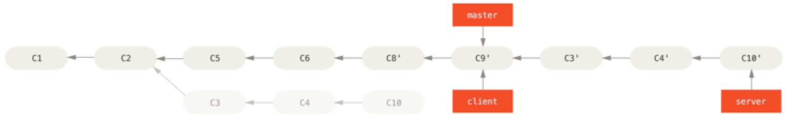

# Rebase

## 作用

> Reference: [the primary reason for rebasing](https://www.atlassian.com/git/tutorials/rewriting-history/git-rebase#:~:text=The%20primary%20reason%20for%20rebasing%20is%20to%20maintain%20a%20linear%20project%20history.)

- `merge` 和 `rebase` 的作用相同，都是为了将一个分支上的 commit 整合到另一个分支上。

- `rebase` 与 `merge` 的区别在于 `rebase` 的提交历史是一条直线，而 `merge` 则包含多条分支：

## 整合到任意分支

> Reference: Pro Git: p94-p97

- `rebase` 可以将一个分支上的 commit 整合到任意分支上。

- `client` 分支可以把不属于父分支（`server`）的 commit（`C8`、`C9`）整合到 `master` 分支；`server` 分支可以把不属于父分支（`master`）的 commit `C3`、`C4`、`C10` 整合到 `master` 分支。

- `git rebase --onto master server client` 表示把 `client` 分支上不属于 `server` 分支的 commit 整合到 `master`。

- `git rebase master server` 表示把 `server` 分支上不属于 `master` 分支的 commit 整合到 `master`。

::: danger
> Reference: Pro Git: p97-p99

不要对已经提交到远程仓库的 commit 进行 rebase。
:::
