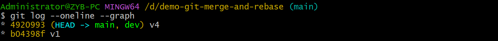

# Rebase

## 作用

> Reference: [the primary reason for rebasing](https://www.atlassian.com/git/tutorials/rewriting-history/git-rebase#:~:text=The%20primary%20reason%20for%20rebasing%20is%20to%20maintain%20a%20linear%20project%20history.)

- `merge` 和 `rebase` 的作用相同，都是为了将一个分支上的 commit 整合到另一个分支上。

- `rebase` 与 `merge` 的区别在于 `rebase` 的提交历史是一条直线，而 `merge` 则包含多条分支：

## 基本用法

> Reference: Pro Git: p92-94

执行 rebase 之前的 main 分支和 extra 分支状态如下图所示。现在要把 extra 上的 commit 整合到 main 分支。

### 方式一

- 执行 `git rebase main extra` 命令后变成了单线结构，并且 `v3` 的哈希值发生了改变。

- main 分支合并 extra 分支。

::: tip
`git rebase <base-branch> <topic-branch>`：把 topic-branch 上的 commit 整合到 base-branch。这个命令在任何分支上都可以执行，不需要切换分支。
:::

### 方式二

- 切换到 extra 分支，执行 `git rebase main`。
- main 分支合并 extra 分支。

## 整合到任意分支

> Reference: Pro Git: p94-p97

- `rebase` 可以将一个分支上的 commit 整合到任意分支上。

- `client` 分支可以把不属于父分支（`server`）的 commit（`C8`、`C9`）整合到 `master` 分支；`server` 分支可以把不属于父分支（`master`）的 commit `C3`、`C4`、`C10` 整合到 `master` 分支。

- `git rebase --onto master server client` 表示把 `client` 分支上不属于 `server` 分支的 commit 整合到 `master`。

- `git rebase master server` 表示把 `server` 分支上不属于 `master` 分支的 commit 整合到 `master`。

## 风险和解决方法

### 风险

> Reference: Pro Git: p97-99

- 使用 rebase 的风险：如果你 rebase 一些之前已经提交到远程仓库的 commit，并且别人基于这个 commit 在开发，那么会导致别人在拉取代码的时候发现有重复的提交，如下图所示：

### 解决方法一

> Reference: Pro Git: p99-100

- git pull ==--rebase== `<repo-shortname>` `<repo-url>`

::: tip
配置 `git config pull.rebase true` 可以让执行 git pull 时默认带 `--rebase` 参数。
:::

### 解决方法二

> Reference: Pro Git: p99-100

- `git fetch`
- `git rebase <base-branch> <topic-branch>`
