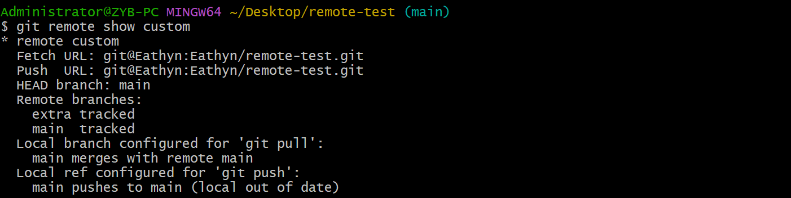

# Remote

## Remote Name

> Reference: [what is the origin in Git?](https://www.git-tower.com/learn/git/glossary/origin)

- `origin` 是远程仓库的简称（shortname），方便后续引用这个仓库：
  - (SSH) git remote add ==origin== git@Eathyn:Eathyn/remote-test.git
  - (HTTPS) git remote add ==origin== https://github.com/Eathyn/remote-test.git

- `origin` 可以改为其他名字。

## Show Remote

> Reference: Pro Git: p49-50

- `git remote`：显示所有远程仓库的简称。

- `git remote -v`：显示所有远程仓库的简称和地址。

> Reference: Pro Git: p52-53

- `git remote show <repo-shortname>`：显示指定的远程仓库具体信息。

## Add Remote

> Reference: Pro Git: p50-51

- `git remote add <repo-shortname> <repo-url>`：添加远程仓库的简称和地址。

- 一个本地仓库可以添加多个远程仓库的简称。

## Fetch and Pull From Remote

> Reference: Pro Git: p51-52

`git fetch <repo-shortname>`：拉取远程仓库的 commit 和分支。

## Push to Remote

> Reference: Pro Git: p52

- `git push <repo-shortname> <branch>`：把当前分支推送到指定的远程仓库的指定分支上。

- 别人正在推送同一个分支时，你无法推送。需要等别人推送完成之后，你重新 pull 这个分支，然后才可以推送。

## Rename Remote

> Reference: Pro Git: p53

`git remote rename <old-repo-shortname> <new-repo-shortname>`：更改远程仓库的简称。

## Delete Remote

> Reference: Pro Git: p53-54

`git remote remove <ropo-shortname>`：删除远程仓库的简称。
