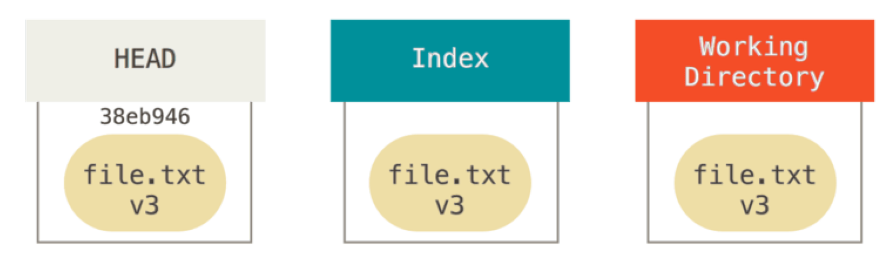
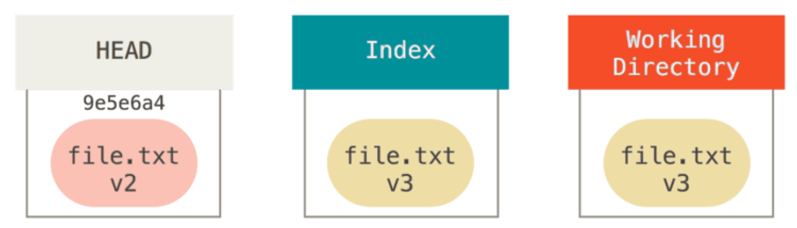
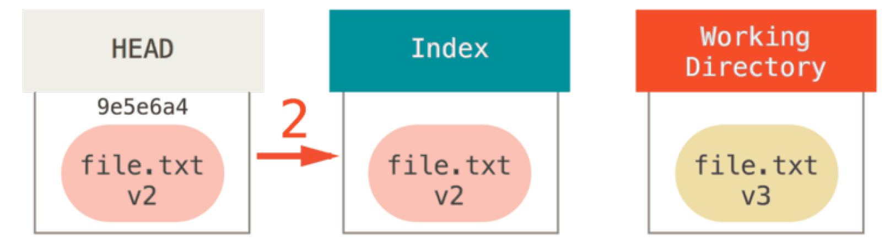
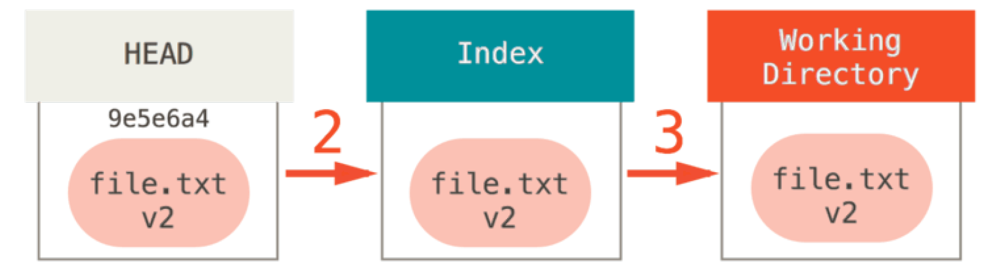
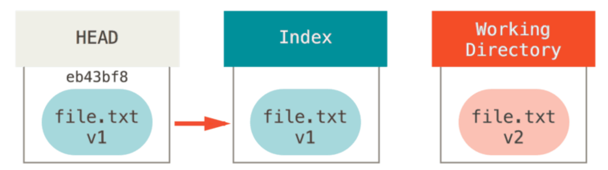
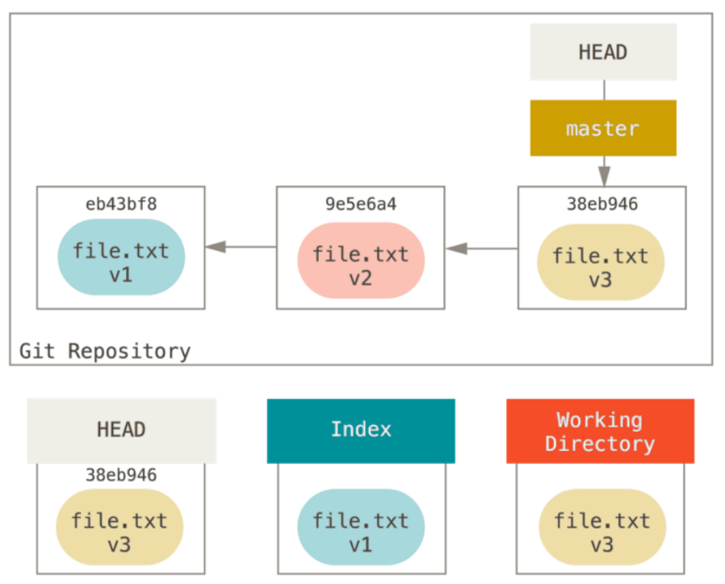
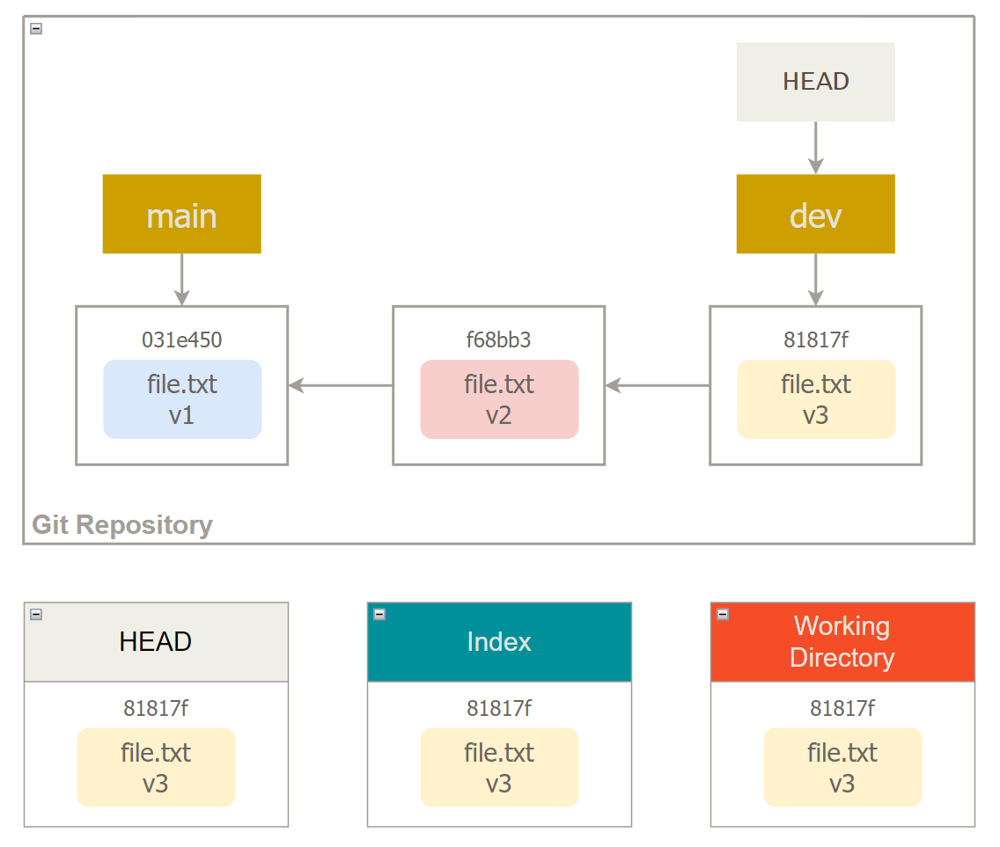
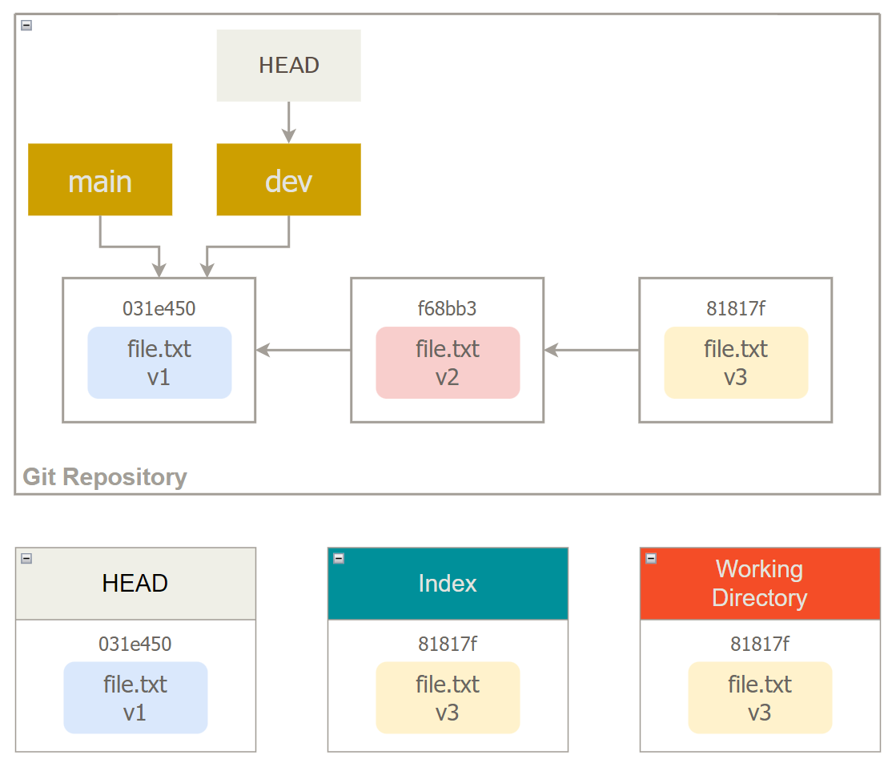

# Reset

## Three Trees

### The HEAD

> Pro Git: p252

HEAD 指向当前分支的最后一个 commit。

> [Blog](https://initialcommit.com/blog/what-is-git-head#what-is-git-head)

使用 `cat .git/HEAD` 可以查看到 HEAD 指向哪一个分支。

### The Index

Index 就是暂存区（staged area）。对在工作目录（working directory）的文件使用 `git add` 之后，这些文件就会添加到暂存区。

### The Working Directory

工作目录（working directory）是编辑文件的地方。

## 切换分支时的内部运行

> Pro Git: p259

1. HEAD 指向切换的分支。
2. 在 Index 中填充这个分支的所有 commit。
3. 把 Index 中的内容复制到工作目录。

## 命令解释

> Pro Git: p259

HEAD 指向分支，分支指向 commit。reset 就是让 HEAD 指向的分支进行移动。

## Soft 选项

### 使用

```git
git reset --soft <commit>
```

::: tip
`HEAD~` 表示向前回退一位

```git
git reset --soft HEAD~
```
:::

### 特点

- 本地仓库（HEAD）重置。
- 暂存区（Index）和工作目录（working directory）不重置。
- 使用 `git commit` 命令可以让本地仓库、暂存区和工作目录保持一致。

### 图示

- 使用 reset 之前三个地方都是相同的（v3）：



- 使用 reset --soft 之后本地仓库（HEAD）重置（v2），暂存区（Index）和工作目录（Working Directory）保持原样（v3）：



## Mixed 选项

### 使用

```git
git reset --mixed <commit>
```

::: warning
`--mixed` 是 `reset` 命令的默认选项。
:::

### 特点

- 本地仓库（HEAD）和暂存区（Index）重置。
- 工作目录（working directory）不重置。
- 使用 `git add` 和 `git commit` 命令可以让本地仓库、暂存区和工作目录保持一致。

### 图示

- 使用 reset 之前三个地方都是相同的（v3）：


- 使用 reset --mixed 之后本地仓库（HEAD）和暂存区（Index）重置（v2），工作目录（Working Directory）保持原样（v3）：



## Hard 选项

### 使用

```git
git reset --hard <commit>
```

### 特点

- 本地仓库（HEAD）、暂存区（Index）和工作目录（Working Directory）重置。

::: danger
使用 `git reset --hard` 后无法通过 `git log` 查找到丢失的 commit，但是可以使用 `git reflog` 查看 HEAD 的变更情况，从而回滚到之前的 commit。
:::

### 图示

- 使用 reset 之前三个地方都是相同的（v3）：


- 使用 reset --hard 之后本地仓库（HEAD）、暂存区（Index）和工作目录（Working Directory）重置（v2）：



## Path Argument

### Reset + Path

- `git reset <file path>` 相当于 `git reset --mixed HEAD <file path>`。即把 HEAD 的内容复制到 Index。



### Reset + Commit + Path

- `git reset <commit> -- <file path>` 相当于：
1. Index 和 Working Directory 回滚到指定的 commit
2. Working Directory 回滚到之前的 commit



- `reset` 支持 `--patch` 参数，即可回滚一个 commit 中的部分内容。

## Reset + Branch

### Soft

- 执行 `git reset --soft main` 之前，dev 分支的 HEAD、Index 和 Working Directory 都是 `v3`。



- 执行 `git reset --soft main` 之后，dev 分支的 HEAD 与 main 分支的 HEAD 相同，是 `v1`。Index 和 Working Directory 保持不变，是 `v3`。



### Mixed

- 执行 `git reset --mixed main` 之前，dev 分支的 HEAD、Index 和 Working Directory 都是 `v3`。
- 执行 `git reset --mixed main` 之后，dev 分支的 HEAD、Index 与 main 分支的 HEAD、Index 相同，是 `v1`；Index 和 Working Directory 保持不变，是 `v3`。

### Hard

- 执行 `git reset --hard main` 之前，dev 分支的 HEAD、Index 和 Working Directory 都是 `v3`。
- 执行 `git reset --hard main` 之后，dev 分支的 HEAD、Index、Working Directory 与 main 分支的 HEAD、Index、Working Director 相同，是 `v1`。

## Checkout vs Reset

- `checkout` 也和 `reset` 一样控制 `HEAD`，`Index` 和 `Working Directory`。

### Without Paths

### With Paths

## Refs

- [Pro Git](https://a.co/d/hzFin1j)
