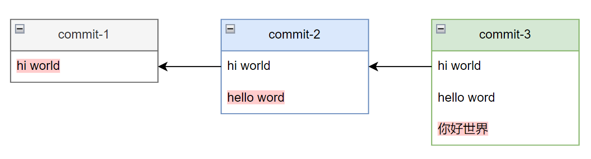
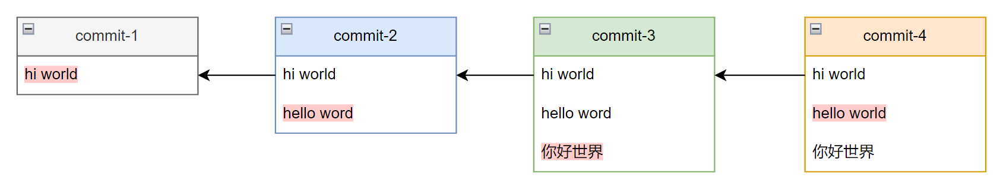
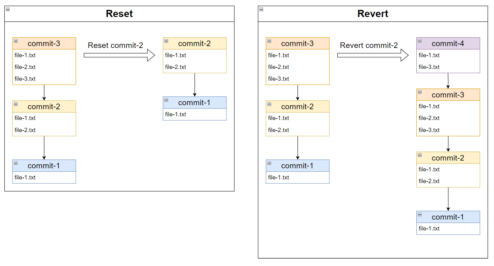

# Revert

> Reference:
> - Git for Teams : p137-138
> - Professional Git : p147-150

## 基本使用

- `git revert <commit>`：自动新建一个 commit，这个 commit 不包含指定 commit 的提交内容，包含指定 commit 的前面和后面的所有 commit 的提交内容。

## 例子

- `commit-1` 在文件中写入 `hi world`；`commit-2` 在文件中写入 `hello word`；`commit-3` 在文件中写入 `你好世界`。如下图所示：

- 使用 `git revert commit-2` 将 `hello word` 改为 `hello world`。Git 自动创建 `commit-4`，这个 commit 包含 `commit-1` 和 `commit-3`，不包含 `commit-2`。如下图所示：

::: tip
- `revert` 会创建一个新的 commit。
- `revert` 会保留该 commit 前面和后面的所有 commit。
:::

## revert vs reset

- `reset commit-2` 不会保留 `commit-2` 之后的提交（即 `commit-3`）；`revert commit-2` 会保留 `commit-2` 之后的提交（即 `commit-3`）。
- `reset` 不会创建新的 commit；`revert` 会创建新的 commit（即 `commit-4`）。

::: danger
如果要回滚的 commit 已经推送到远程仓库，则应该使用 `revert`。如果使用 `reset` 后续需要强制推送到远程仓库，强制推送的可能会造成以下问题：
- 强制推送存在一定的危险性。
- 团队成员在拉取代码时需要进行一次合并。
- 团队成员的本地环境还存在着你不想要的提交（即位于 `B` 之后的那些 commit），这些提交会被推送到远程仓库，下次你拉取代码时还会出现。
:::
