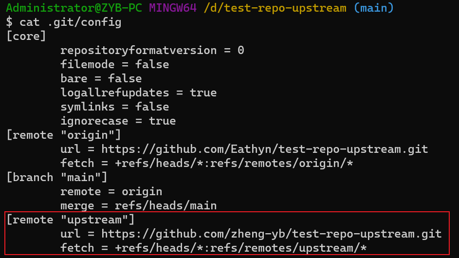
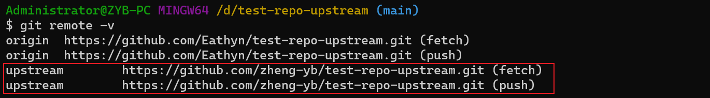
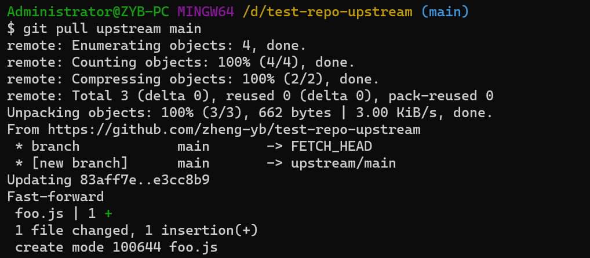
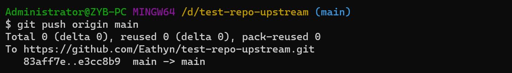
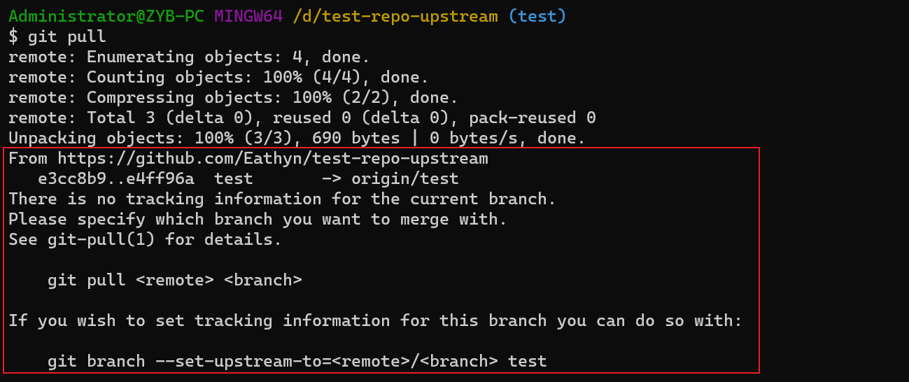
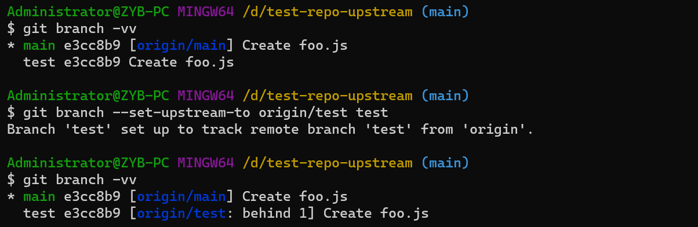
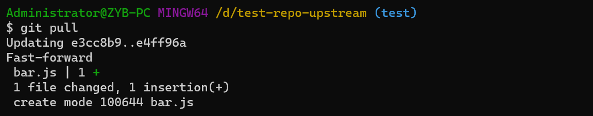

# Upstream

## 为仓库设置 upstream

> [blog](https://devopscube.com/set-git-upstream-respository-branch/)

### 原因

将 main repo 设置为 forked repo 的 upstream，就可以让 forked repo 与 main repo 保持同步。

### 例子

- A: 原始 repo（别人的 repo）
- B: fork A 得到的 repo（自己源端的仓库）
- C: clone B 得到的 repo（自己本地的仓库）

如果没有将 C 的 upstream 设置为 A，那么当 A 更新时，C 无法拉取 A 更新的内容。需要将 C 设置为 A 的 upstream。命令如下：

```git
git remote add upstream <repo A>
```

使用 `cat .git/config` 可以看到已经配置了 upstream。如图所示：



也可以使用 `git remote -v` 查看 upstream 配置。如图所示：



配置完 upstream 之后，就可以使用 `git pull upstream <branch>` 拉取 upstream repo 的分支的 commit 记录。如图所示：



最后再把本地分支（A）push 到 forked repo（B）进行更新。如图所示：



## 为分支设置 upstream

> [blog](https://devopscube.com/set-git-upstream-respository-branch/)

### 原因

在本地仓库新建分支 `test`，并使用 `git push origin test` 将 `test` 分支推送到远端仓库。如果远端仓库的 `test` 分支有新的 commit，那么使用 `git pull` 将无法将远端更新到本地。因为此时 Git 不知道要将哪个远端的分支合并到本地的 `test` 分支，即本地仓库的 `test` 分支没有设置 upstream。警告如下：



### 例子

根据 Git 的提示，指定要拉取的分支可以更新本地的分支。命令如下：

```git
git pull <remote> <branch>
```

也可以为本地分支设置 upstream，命令如下：

```git
git branch --set-upstream-to <remote>/<branch> <local branch>
```



这时候再使用 `git pull` 就可以更新 `test` 分支了。如图所示：



## Refs

- [Set Git Upstream Repository Branch](https://devopscube.com/set-git-upstream-respository-branch/)
