# Git Flow

## 初始化

- 使用 `git flow init` 命令初始化项目，同时设置分支名称和前缀：

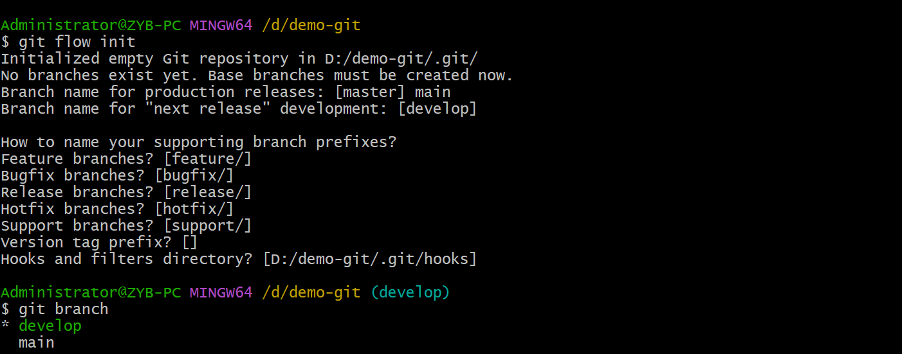

- `main` 分支用于发布线上版本，`develop` 分支用于整合 feature 分支。

## Feature 分支

feature 分支的父分支是 develop 分支。feature 分支完成后合并到 develop 分支：

### 使用 Git flow 命令

```git
# 从 develop 分支中开辟新的 feature 分支。feature-branch 不需要加 `feature/` 前缀
git flow feature start <feature-branch>

# 将新的 feature 分支合并到 develop 分支。feature-branch 不需要加 `feature/` 前缀
git flow feature finish -k <feature-branch>
```

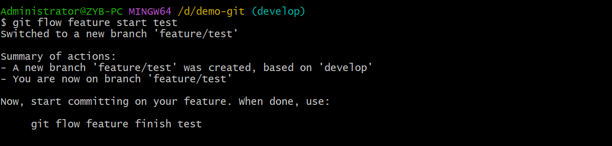

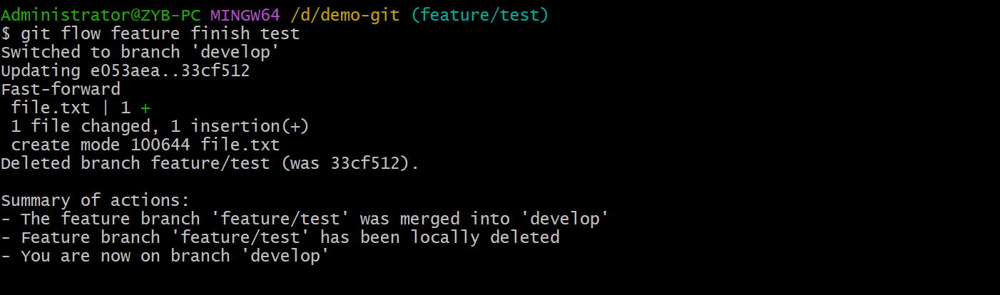

::: danger
执行 `git flow feature finish <feature-branch>` 后，新建立的 feature 分支会被删除，如果不想自动删除，则应该增加 `-k` 参数：

```git
git flow feature finish -k <feature-branch>
```
:::

### 不使用 Git flow 命令

```git
# 切换到 develop 分支
git switch develop

# 从 develop 分支开辟 feature 分支。需要加 feature/ 前缀。
git branch feature/<feature-branch>

# 切换到 feature 分支并进行开发
git switch feature/<feature-branch>

# 切换到 develop 分支，合并 feature 分支
git switch develop
git merge feature/<feature-branch>
```

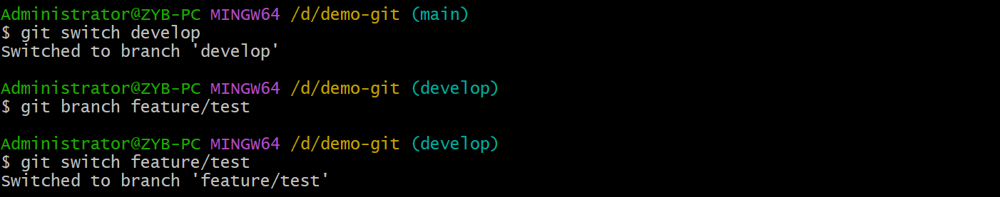

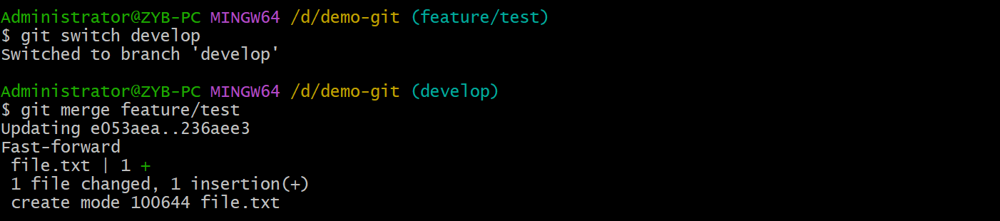

## Release 分支

- 当功能开发完毕并且 feature 分支合并到 develop 分支后，应该从 develop 分支开辟 release 分支，将 release 分支放到预发布环境，让测试部门到预发布环境再进行测试。
- release 原则上不可以再添加新功能，只能进行修复 bug，生成文档等事情。
- 如果要 release 分支上进行的任务都已经完成，就把 release 分支合并到 main 分支和 develop 分支。合并到 main 分支是为了上线，合并到 develop 分支是因为 release 分支可能有新的 commit，要将这些 commit 也同步到 develop 分支。
- release 分支的名称可以是 tag。

### 使用 Git flow 命令

```git
# 从 develop 分支开辟 release 分支
git flow release start <release-branch>

# 将 release 分支合并到 main 分支和 develop 分支
git flow release finish -k <release-branch>
```

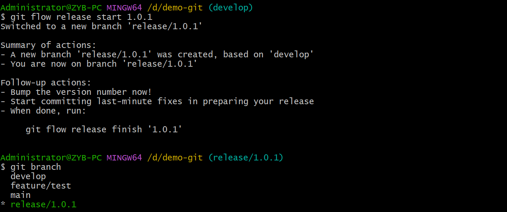

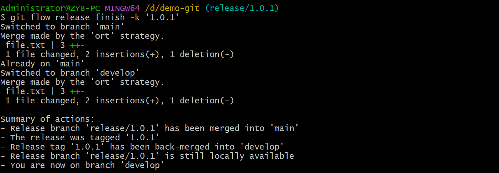


::: danger
执行 `git flow release finish <release-branch>` 后，新建立的 release 分支会被删除，如果不想自动删除，则应该增加 `-k` 参数：

```git
git flow release finish -k <release-branch>
```
:::

### 不使用 Git flow 命令

```git
# 从 develop 分支开辟 release 分支
git branch <release-branch>

# 切换到 release 分支并修复 bug
git switch <release-branch>

# 修复 bug 完成之后将 release 分支合并到 main 分支和 develop 分支，并在 main 分支上打 tag
(main) git merge <release-branch>
(main) git tag <version>
(develop) git merge <release-branch>
```

## Hotfix 分支

- hotfix 分支用于修复线上 bug。
- hotfix 分支的父分支为 main 分支。
- 在 hotfix 分支上修复 bug 之后要将其合并到 main 和 develop 分支上（可能需要手动合并到 release）。
- hotfix 分支合并到 main 分支之后，要在 main 分支上打 tag。

### 使用 Git flow 命令

```git
# 从 main 分支开辟 hotfix 分支
git flow hotfix start <hotfix-branch>

# 修复 bug 之后将 hotfix 分支合并到 main 分支和 develop 分支，并给 main 分支打 tag
git flow hotfix finish -k <hotfix-branch>
```

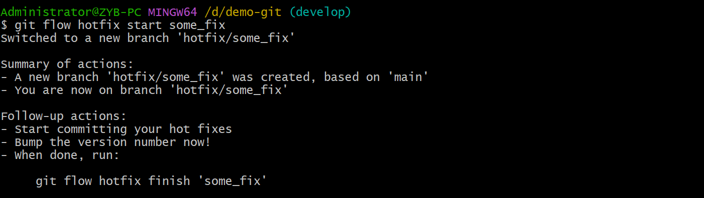

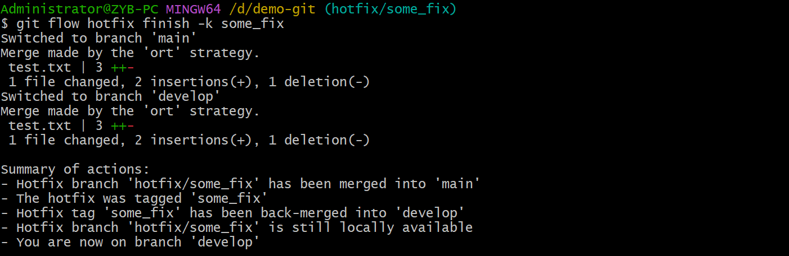


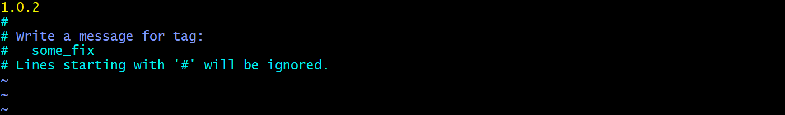

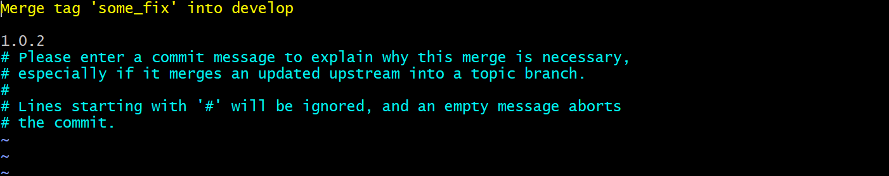

### 不使用 Git flow 命令

```git
# 从 main 分支开辟 hotfix 分支并切换
(main) git branch <hotfix-branch>
(main) git switch <hotfix-branch>

# 修复完 bug 之后将 hotfix 分支合并到 main 和 develop 分支，并打 tag
(main) git merge <hotfix-branch>
(main) git tag <version>
(develop) git merge <hotfix-branch>
```

## Refs

- [gitflow repo](https://github.com/nvie/gitflow)
- [beginner](https://www.atlassian.com/git/tutorials/comparing-workflows/gitflow-workflow)
